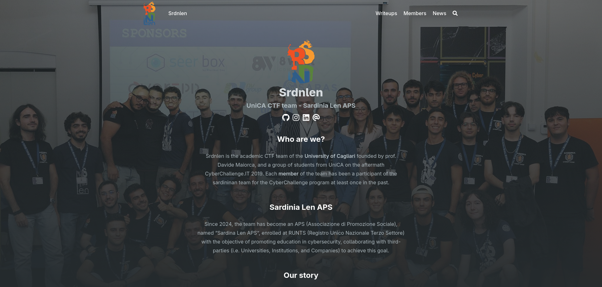
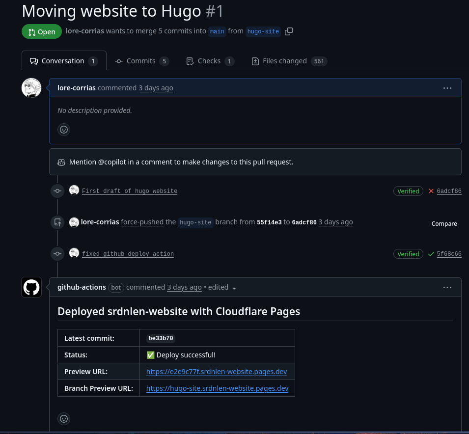
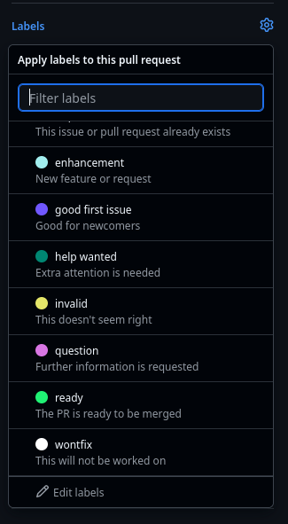

# srdnlen.it



This is the code for the official website of Srdnlen.

## Adding a member

In order to add a member, you can run the `add-author.py` script and follow the instructions. Please note the following:

1. Do not add captain members (for obvious reasons).
2. If you want to add a professor, select "Y" on the "Is the user a professor option", and then do not add any other tag.
3. The trainer/professor/captain tag are always the main roles, so please do not change the order manually.
4. Please note that members may have any number of secondary tag, but be modest :)
5. Follow steps 4-6 of "Adding a post".

> [!IMPORTANT]
>
> The members' informations are stored under the `data/authors` repository. If you need to make any changes, please edit this file. If you need to edit your image, you can edit the file under `assets/img/members`

## Adding a post

There are mainly two different type of posts:

1. Writeups, which can be added by any member of the team through a pull request
2. News, which can be added by authorized members only (note that a PR for a news article will be rejected if you haven't asked for permission first!)

If you would like to submit a new writeup, you can follow these steps:

1. Create a new branch or fork the repository to your personal profile
2. Clone the repository locally
3. If you want to create a writeup, add a folder to `content/writeups/<writeup-name>`.
    ```bash
    hugo new content/writeups/<title>/index.md -k writeup
    ```
4. Once you are done making your edits, create a pull request. This will trigger a GitHub action that will build the website on a temporary URL, from which you can see your edits. The new link will be added as a comment to the PR like this:

    
5. Double check your edits, then add the label "ready" to the request

    
6. Wait for an admin to merge your PR

> [!IMPORTANT]
> If you need to use images for a post, please add them to the same directory where your index.md is stored. You can set a thumbnail for your post by simply uploading an image named featured.{png,jpg}.

### Credits

This website was built using Hugo with the [Blowfish](https://github.com/nunocoracao/blowfish) theme.
