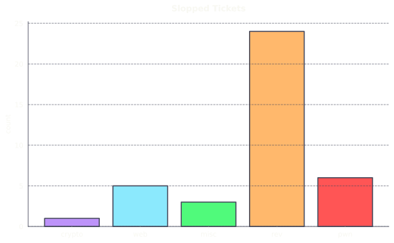
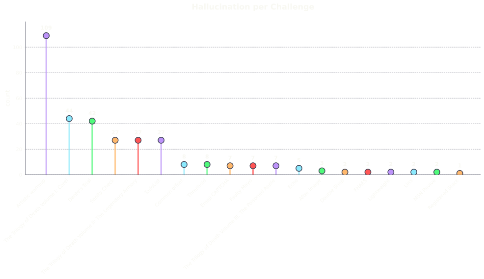

> You are trying to solve a challenge with the use of an Agentic AI. At some point it returns a flag that the platform does not accept, what do you do?
> - Tell the LLM this is wrong, close it, and try solving the challenge yourself
> - Tell the LLM this is wrong and to try again
> - Open a ticket and tell the authors there is a problem with the competition platform and their flag is wrong

Well, we thought everyone would go with the first or, maybe, the second. 
But against all our reasoning skills, the correct one seems to be the third, at least for some.

In this article we will illustrate what happened during SrdnlenCTF 2026 edition,
and explore some of our thoughts on the matter. In the hope it will be helpful
and will guide the CTF community to the right track.

---

## Before we start
During the development of this year’s edition of SrdnlenCTF Quals, 
we knew AI would’ve been massively used, and we invested a lot 
of effort in creating challenges that were well calibrated to:
- Allow beginner, intermediate and more advanced players to have fun.
- Prioritize the learning and improvent of players' skills.
- Discourage the use of LLMs by tackling uncommon and low level topics.

We tried to counteract the use of AI, not because it was forbidden by the
rules, but because we thought, as organizers, that the responsability to keep
the competitiveness high and make people improve was on us.

But, even with it, there are always compromises. 

It prooved very hard to create challenges that were not sloppable, and at the
same time _human-solvable_ and it feels kind of apocalyptic to say that.

In the world of CTFs since a few months ago the big red 
flag was guessy and not fun challenges. But now, instead, the red flag seems 
to be sloppable not awarding challenges, that the players just call “easy”,
without realising that what they just solved is sometimes long way off their skill set.

---

## During the event
During the event we witnessed something miles off from what we expected. From
the first hour of competition we got the feeling that the average solve time for some
challenges was lower and the number of solves way higher.

And we kind of expected that. But again there was still something more going on.

This impression was confirmed by amount of nosense tickets we got.

Out of around 230 tickets, 186 of them were about the challenges, and out of
those, we identified 39 of them with visible proof of moderate to full slopping, 
meaning the use of AI without human intereaction outside of prompting,
resulting in very little to none understanding of the problem from the player.

After answering some tickets we found out that players were also submitting
completely allucinated flags conviced to be true, and this is where the initial quiz
comes from!

To analyze this data we took the entire `submissions.json` and calculated the <u>[Levenshtein distance](https://en.wikipedia.org/wiki/Levenshtein_distance)</u> between the correct flag and the submitted one, to
classify typo-derived and hallucinated submissions.

We do that excluding:
- anything that doesn't have at least 1 number, 1 letter and 1 underscore inside
  `srdnlen{here}`
- `REDACTED`, `fake_flag` or `example`
- submissions for `Cornflake v3.5` and `Rev Juice` because they had multiple
  possible answers
- all flags submitted for a challenge with a low Levenshtein distance with the correct flag of a different
  challenge
- few submissions by hand

In the end we found that out of 1187 total wrong submissions, around 330, almost 1/3, were hallucinated submissions.

With some of the funniest ones being:
- `srdnlen{this_is_placeholder_flag_since_actual_flag_not_retrieved}`
- `srdnlen{1_h8p3_th15_Gl4ss_Of_Mirt0_w4rm3d_you_3nough}` 
- `srdnlen{dante_is_back_from_hell}`
- `srdnlen{summer_is_coming_with_flowers}`
- `srdnlen{pl5_m4k3_1t_w1d3r_br0}`

As last, we found out of 1457 registered users, 487 were registered as Codex
Agents with temp emails and team name starting with `cx*`, prooving the, if not
prooved enough, massive use of AI during the event.

---

## Our considerations
Again, it is very important to remember that slopping was not forbidden, but...

We wanted to share this data to make the community aware of this fenomenon, and
stimulate a discussion on how, or if, to deal with it.

At this rate in fact, 2 things are happening:

### Sloppable as metric
When massive use of this tools is made, players lose the interest to understand
the problem, and just try to find the best prompt to find the flag. They stop
caring about the challenge itself.

Here the new metric to classify a good or bad challenge isn't learning or
difficulty anymore, but **sloppability**.

### Competitiveness or learning 
It's been clear, with this report, but also with the existing research on the
use of LLMs (e.g. the <u>[MIT](https://arxiv.org/abs/2506.08872)</u> or <u>[Anthropic](https://arxiv.org/pdf/2601.20245)</u> studies), that the "_user_" loses the ability to focus on the task, and at the end the understanding is almost none.

So, what should we prioritize? If we prioritize the learning we are forced to limit
the use of LLMs and avoid completely the use of the so called agentic models.
But by doing so, we lose completely the competitiveness of CTFs because there
will always be someone who wants the 1st place, the trip to Sardinia or the 500$
on an hosting platform.

But if we choose competitiveness, not caring at all about improving, then we
face another doubt, what do we compete on?

If the strength of a team or a player is measured by how well they use these
tools, or by how good these tools are, it looks more like a pay2win/prompt2win.

So what is this up to? Who builds the best pipeline wins? Or whoever writes the best text in
natural language? And is this about cybersecurity at all anymore?

And finally, what are even CTFs anymore, training data for large tech companies
to improve their models?

---

## Conclusions
In the next months, for sure, something will change. Some teams will choose to
not compete and prioritize the learning, while some others will go for the
opposite. 

We hope that in the meantime the best CTFs' organizers will take decisions that
could enlighten us.

Certainly, DefCON could lead this change.

And, as introduced by our
coach Davide Maiorca on his discord post (attached below), this resembles the
1996 chess match of Garry Kasparov against DeepBlue, where for the first time a
machine beats a human in the game of chess. 

And just as it is considered cheating and unfair, in chess, to use chess engines, eventually it may be considered cheating and unfair the use of these tools in CTFs.

While we believe a new concept of CTFs should be studied and developed, we'll work on the frontline for our 2026 Finals to keep the event fair and fun for everyone!

---
Thank you for reading, with love, 
 Srdnlen <3

