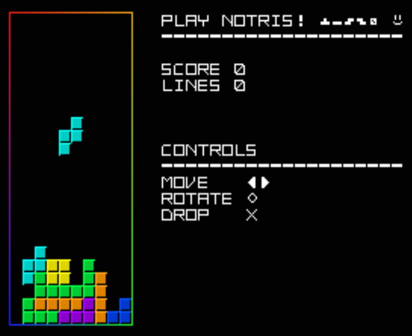

# Vulnitris

**CTF:** Srdnlen CTF 2025 Finals\
**Category:** pwn\
**Difficulty:** medium-hard\
**Authors:** @church (Matteo Chiesa) & @davezero (Davide Maiorca)

## Description

> On PlayStation the blocks descend,\
In crooked towers they twist and bend.\
I play and play, the rules won't bend-\
Tell me, Tetris, where's the end?

## Overview

The challenge is composed by a **PSX executable file**, containing a custom game similar to Tetris, called Nortis. This is the same game executed in the actual PS1 on-site, the only difference is the non-redacted flag. Playing with the on-site PS1, you have to interact with the game using only the joypad, and since this is a pwn challenge, the goal must be to alter the execution flow for profit.

The PSX uses a MIPS-le architecture, so we can open this executable with a disassembler/decompiler without too much effort.

To play and debug that ROM, we are going to use [*no$psx*](https://problemkaputt.de/psx.htm), a PSX emulator and debugger.

## Solution

### Discover the win function

Looking at the strings, we can notice a redacted flag. Using *no$psx*, we can jump to the function at `0x80010CCC`, where there is a reference to the redacted flag, and discover that function prints the redacted flag. **This is the win function**, but it's never called during the normal execution flow.

### Reverse the binary

Exploring the binary, we can easily recognize the function at `0x80010000` as the `main()` function, and in it there is the function at `0x800110E8`, which is the `get_input()` function, due to its structure with the *AND* operator, to check if a certain key is pressed.

Defining the various cases for each key, we can notice that for some imput, before calling the function relative for that action, it also increases by 1 a certain byte. In particular, **it increases the byte at `0x80016144` in case of a lateral movement** (left or right), and **it increases the byte at `0x80016145` in case of an hard drop** (when you slam down the active piece to the bottom).

These two bytes are immediatly after an array of five integers, at `0x80016130`, and following the xref, we can notice it is xored in the stack by the function at `0x80010528`. **The length of the buffer is determined by the integer at `0x80016938`**.

Setting a breakpoint on `0x80010528`, we can notice this function is called during the clearance of any line, and normally the length of the array is set to 0. From the stack, we can notice the distance between the array and the nearest return address is 6 integers, so **if the length is 6 or more the *int* at `0x80016144`, which is partially controlled by us moving the active piece, is xored with the return address**.

### Discover the vulnerability

PLaying at the game, maybe we can notice a strange behavior: when we rotate the active piece, sometimes it clips into the other pieces or the wall. Exploring the movement function (the ones called in the main switch), we discover that in all of them the return value of the `0x80010BA0` function is checked, except in the rotate function. That is the function that checks for collisions. **During the rotation there isn't the check, so the piece can clip into other elements**.

This leads to a buffer overflow: **we can override something over the buffer of the game pieces field**, putting a portion of a piece over the right wall, and dropping it to the bottom. The portion of that piece will write the integer after the end of the buffer field.
**That exactly location corresponds to `0x80016938`, where there is the integer that determines how much of the previous array will be copied in the stack!**

### Build the exploit

If we can write in `0x80016938` a number *>=6*, we can trigger the stack overflow and override the return address.

Watching the values of that integers, the number that is written depends on the type of the piece: we can write a number *>=6* only triggering the collision bug with the `T` piece or the `Z` piece.

Now we need to understand which values has to be in `0x80016144` and `0x80016145` bytes. The original return address we can override has the value `0x800106D0`. The two bytes controlled by us will be xored with the less-significant bytes of that address, and we want this address to be `0x80010CCC`. We can calculate the two bytes must be `0xD0 ^ 0xCC = 0x1c = 28` and `0x06 ^ 0x0C = 0x0A = 10`. This means that we want to trigger the stack overflow (so we want to clear a line) after 28 lateral movements and 10 hard drops.

The last step is playing the game! You will need a couple of tries and you are done.

On the down right of the game field in the image, a T piece rotated and clipped into the wall to trigger the buffer overflow when a line is cleared

Some suggestions to trigger successfully the exploit:
- Act as you are playing regular Tetris: fit the pieces in the best way possible, and it will be much simpler to clear the line wheneven is the moment.
- Play with a friend: you have to keep two different counts, for the moves and the drops. You can count the moves until 28, while your friend can keep the hard drop count and alert you when you reached 10.
- For a move to count, doesn't need the piece actually moving, you can press the left key and increase your count by one even if the piece is blocked by a wall.

**srdnlen{1S_7H4T_7H3_F1N1SH_0F_T3TR1S?}**
