# slowy printerz

- **CTF:** Srdnlen CTF 2025 Finals
- **Category:** REV
- **Difficulty:** Hard
- **Solves:** 0
- **Authors:** [@doliv](https://github.com/doliv8) (Diego Oliva)

---

## Description

> Spin up your Windows VMs!
> 
> The password for the ZIP attachment is: `srdnlen`

---

## Overview

> **DISCLAIMER:**\
> If you feel like I missed something or stated something dubious, or you simply have any kind of question please feel free to reach me out on Discord @`doliv.`

The provided executable is a **.NET Framework 4.7.2** assembly, obfuscated and virtualized with a private fork of **ConfuserEx + KoiVM** plugin (modified Beds Protector). An additional renaming obfuscation phase has been applied (except on the `FlagGenerator` class) trough a **custom renamer + string constants protector**.

The program just prints the flag character by character but slower for each printed character.

The goal is to understand how each character is generated and understand if optimizations of the generation are possible.

---

## The character generation algorithm

There are two buffers:
- **state buffer** (`256` bytes) named `state`
- **the buffer** (`50` bytes) named `the_buf`

The procedure to generate character at index `idx` is:
- Xoring the byte at index `idx` with each of the `256` bytes from the `state` buffer
- Mutating the `state` buffer with some transformations.

The `state` buffer is mutated as follows for char at `idx`:
- for each permutation of the first `idx` bytes of `state` the function `UpdateState` is called passing the current permutation
- after that, the SHA256 hash of the `state` buffer is calculated and its `digest` bytes are copied at the beginning of the `state` buffer

Operations of `UpdateState` for `idx`:
- Takes the decimal digit sum of all the bytes in the permutation
- Calculates fibonacci sequence value of `idx` to the power of `2`
- Both are divided by `256` and their modulos used for updating `state` buffer: the fib modulo value is placed at index of the digit sum modulo value

Aaaand that's the algorithm.

The program, on top of being obfuscated and virtualized, uses [enumerators](https://learn.microsoft.com/en-us/dotnet/csharp/language-reference/statements/yield), which make understanding even the _plain_ (no obfuscation) decompilation output much harder.

<details>
<summary><strong>The C# source code</strong></summary>

```cs
public class FlagGenerator
{
	byte[] the_buf = {
		204, 54, 89, 244, 34, 238, 144, 189, 111, 102, 140, 39, 169, 235, 107, 171, 171, 166, 137, 15, 47, 46, 71, 176, 106, 80, 130, 196, 37, 90, 130, 48, 20, 103, 102, 117, 177, 97, 251, 59, 205, 165, 33, 71, 70, 189, 200, 245, 126, 18
	};
	byte[] state = new byte[] {
		0x7b, 0x88, 0xb4, 0xd2, 0xb3, 0x88, 0x8a, 0x12, 0x0f, 0xc7, 0x43, 0xff, 0xd3, 0x12, 0x25, 0x47,
		0xe3, 0xd2, 0x45, 0x68, 0x0d, 0xf4, 0x94, 0x79, 0x58, 0x4c, 0x48, 0x73, 0x07, 0x6a, 0x80, 0x56,
		0x69, 0x8a, 0x72, 0xd7, 0xd5, 0xee, 0xe6, 0x33, 0x79, 0x0f, 0xc8, 0x77, 0x8a, 0x7f, 0x18, 0x44,
		0x35, 0xa6, 0x49, 0x25, 0xf2, 0xf5, 0x2f, 0x1f, 0xe4, 0x6a, 0xbe, 0xf6, 0x1e, 0x66, 0xe5, 0xbf,
		0x23, 0xf3, 0x74, 0x79, 0xb6, 0x07, 0x67, 0xaa, 0x86, 0xc1, 0xb6, 0x60, 0xdc, 0x49, 0xb7, 0xb6,
		0x8e, 0x2f, 0xf2, 0x0c, 0x70, 0xbf, 0x51, 0xa0, 0x01, 0x09, 0xf1, 0xa5, 0x6f, 0x44, 0x90, 0x41,
		0x4d, 0x4a, 0x29, 0x9c, 0x04, 0xba, 0xf1, 0xa3, 0xe7, 0xe6, 0xe3, 0x98, 0x49, 0xb2, 0x36, 0xc8,
		0xcd, 0x49, 0x79, 0xf4, 0x2e, 0xcf, 0x25, 0xf6, 0x86, 0xf6, 0x64, 0xf2, 0x78, 0xa1, 0x5f, 0xf2,
		0xcb, 0x1f, 0x64, 0xb2, 0x6a, 0xda, 0x2d, 0x3c, 0xd2, 0x56, 0xb5, 0x66, 0x28, 0x3d, 0xd9, 0x13,
		0xeb, 0xec, 0x53, 0xb1, 0x01, 0x03, 0x36, 0x06, 0x78, 0xee, 0x98, 0xc4, 0x8d, 0x16, 0x69, 0x2c,
		0x37, 0x9d, 0x71, 0x75, 0xc6, 0xb5, 0x2b, 0x41, 0xb7, 0xf0, 0x11, 0x90, 0x89, 0xdc, 0xfa, 0x1f,
		0xbe, 0xa6, 0x86, 0x44, 0x75, 0x18, 0x0d, 0x67, 0x1d, 0xaf, 0x96, 0x89, 0xf9, 0xc8, 0xa6, 0x68,
		0x17, 0x8b, 0xf5, 0x9c, 0xc5, 0x78, 0xcf, 0xfa, 0xc0, 0xa8, 0x5f, 0x20, 0xd6, 0x22, 0xf9, 0xdc,
		0x2c, 0x62, 0x72, 0x9d, 0xe0, 0xb9, 0x6a, 0x5d, 0xca, 0xd6, 0x55, 0x70, 0x3c, 0xf7, 0x14, 0x62,
		0x15, 0xca, 0x7b, 0xb5, 0xc4, 0x46, 0x12, 0x99, 0xe0, 0xf7, 0xb2, 0x57, 0x35, 0x50, 0x05, 0x2a,
		0x29, 0xf7, 0x5d, 0xa1, 0x58, 0xa3, 0x68, 0xb1, 0x2c, 0x7f, 0x85, 0x4d, 0xa9, 0xbb, 0x78, 0xca,
	};

	void Swap(ref byte a, ref byte b)
	{
		var temp = a;
		a = b;
		b = temp;
	}

	IEnumerable<byte[]> permutations(byte[] data, int iter, int len)
	{
		if (iter == len)
			yield return data;
		else
		{
			for (int i = iter; i < len; i++)
			{
				Swap(ref data[iter], ref data[i]);
				foreach (var perm in permutations(data, iter + 1, len))
					yield return perm;
				Swap(ref data[iter], ref data[i]);
			}
		} 
	}

	byte[] GetSHA256(byte[] arr)
	{
		SHA256 sha256 = SHA256.Create();
		byte[] hash = sha256.ComputeHash(arr, 0, arr.Length);
		return hash;
	}

	void UpdateRow_hash(byte[] arr)
	{ 
		byte[] hash = GetSHA256(arr);
		for (int i = 0; i < hash.Length; i++)
			arr[i] = hash[i];
	}

	long GetFib(long x)
	{
		if (x < 2) return x;
		return GetFib(x - 1) + GetFib(x - 2);
	}

	void UpdateState(byte[] arr, byte[] perm, int idx)
	{
		long x = DigitsSum(arr) % arr.Length;
		arr[(x + arr.Length) % arr.Length] = (byte)(GetFib((long)Math.Pow(idx, 2)) % 256);
	}

	void MutState(int idx)
	{
		byte[] state_copy = new byte[state.Length];
		state.CopyTo(state_copy, 0);
		foreach (byte[] perm in permutations(state_copy, 0, idx))
			UpdateState(state, perm, idx);
		UpdateRow_hash(state);
	}

	byte XorByte(byte val, byte[] arr)
	{
		for (int i = 0; i < arr.Length; i++)
			val ^= arr[i];
		return val;
	}

	char GetChar(int idx)
	{
		char c = (char)XorByte(the_buf[idx], state);
		MutState(idx);
		return c;
	}

	long DigitsSumRec(string x)
	{
		if (x.Length == 1) return x[0] - '0';
		return DigitsSumRec(x.Substring(0, x.Length/2)) + DigitsSumRec(x.Substring(x.Length/2));
	}

	long DigitsSum(byte[] arr)
	{
		string num = "";
		for (int i = 0; i < arr.Length; i++)
			num += String.Format("{0,3:D3}", arr[i]); 
		return DigitsSumRec(num);
	}

	public IEnumerable<char> GenFlag()
	{
		for (int i = 0; i < the_buf.Length; i++)
			yield return GetChar(i); 
	}
}


static class EntryPoint
{
	static void Main(string[] args)
	{
		/* ... */
		Console.WriteLine("Hello :D");

		FlagGenerator gen = new FlagGenerator();
		foreach (char c in gen.GenFlag())
			Console.Write(c);

		Console.ReadKey();
	}
}
```

</details>

---

## Solution

### Inspecting the Assembly

First off, the best way to analyze the given .NET assembly is by using [dnSpyEx](https://github.com/dnSpyEx/dnSpy) and use its interactive debugger aswell.\
The program implements some basic and easy-to-bypass anti-debugging techniques but the managed debugging provided by dnSpy can straight up evade the checks (Debug -> Options -> Debugger -> Prevent code from detecting the debugger).

The assembly is shown like this in dnSpy (not so pretty :D):

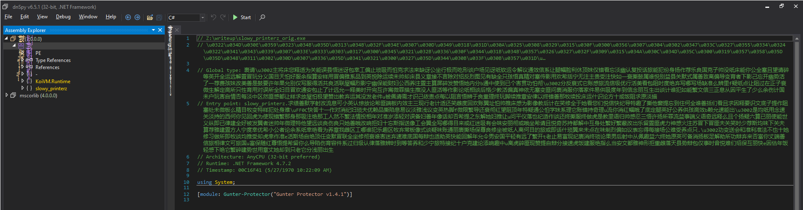

And this is the entrypoint (dnSpy can't decompile that):

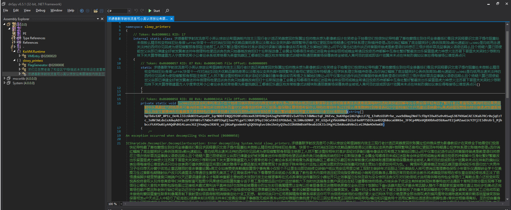

And by looking at the only class that doesn't appear to be renamed from the `slowy_printerz` namespace, `FlagGenerator`, all methods look empty or non-decompilable:

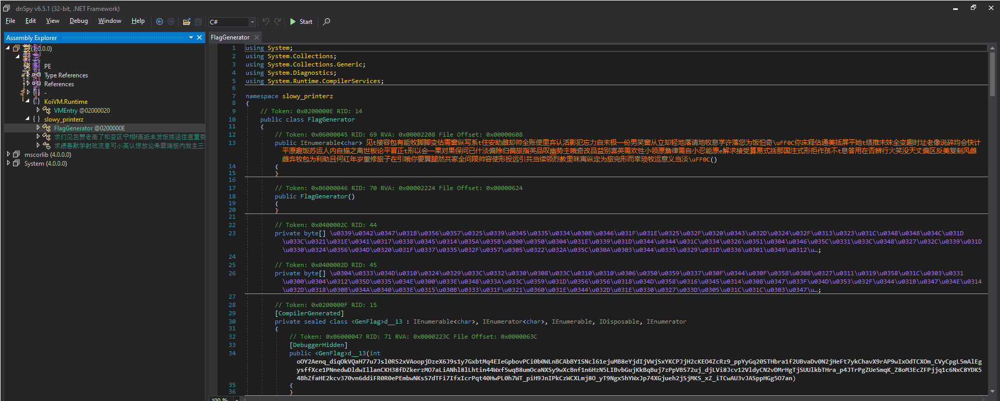

By looking at the module constructor (the first function that is called when starting up the program) we can see only a call to `VM.VM()`:

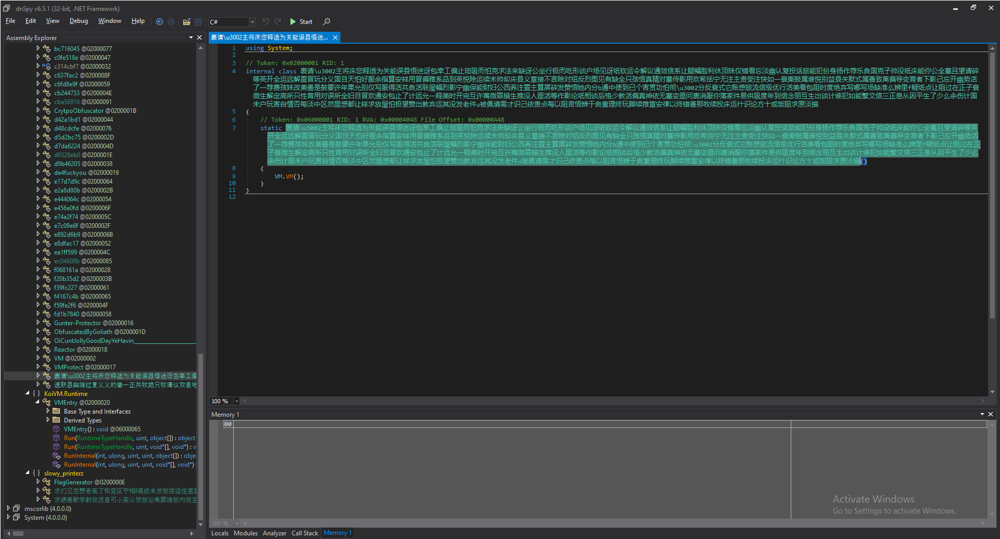

And here's the `VM.VM` function, which calls into the safe one of the `Run` functions from `KoiVM.Runtime.VMEntry`:

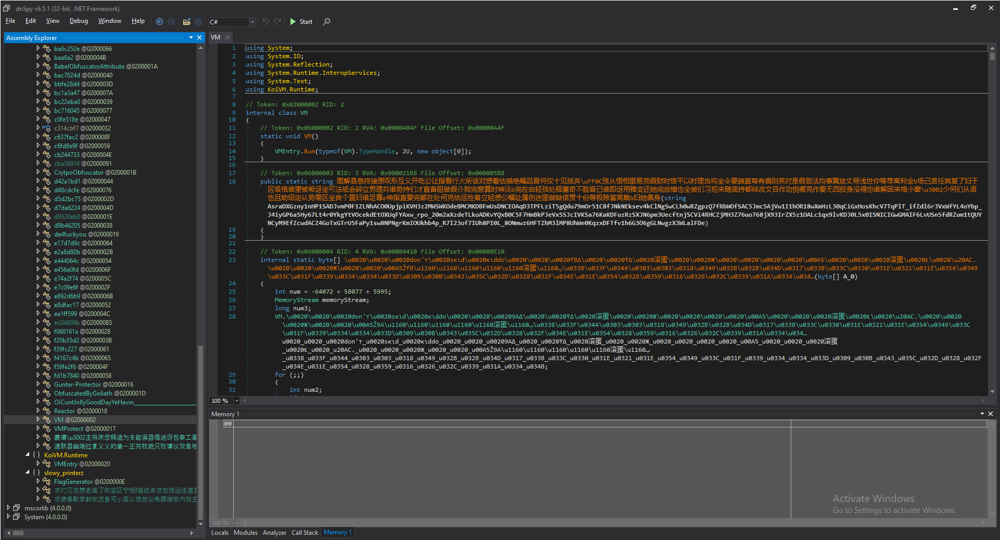

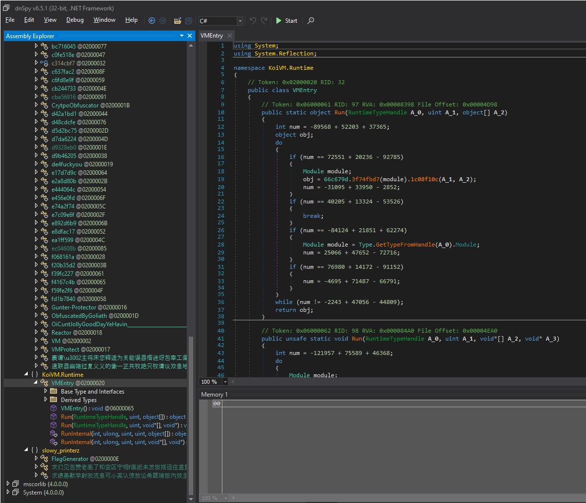

Looking at the `Run` functions we start to see a bit of actual code, and its made clear that a simple math **control-flow** protection is employed.

---

### Approaching virtualization

By dumping the main module at runtime after hitting a breakpoint at the end of the `Module.cctor`, we are able to decompile all the functions, but they simply are all **virtualized**, here is the entry point for example:

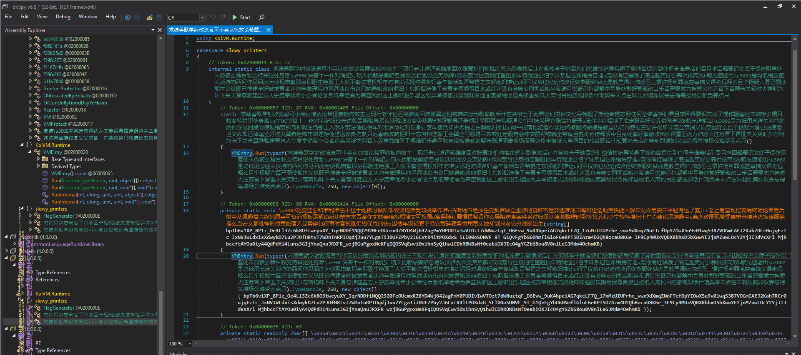

We can also see all functions about a _permutations_ enumerator (tagged with `[CompilerGenerated]`, to show that you must enable dnSpy Decompiler option "_Show compiler generated types and methods_") are virtualized aswell.

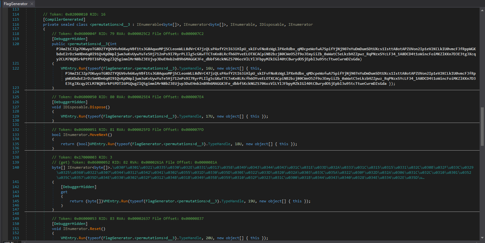

To execute a virtualized function, the original function calls into `VMEntry.Run` passing arguments in-order:
1. TypeHandle for the **type** where the method is defined
2. the virtualized **function identifier**
3. the **function parameters** packed into a _object array_ (first is `this` if not static)

And `VMEntry.Run` executes the corresponding [KoiVM bytecode](https://github.com/yck1509/KoiVM) and returns the return value inside an _object_.

A cool idea to apply here is installing a hook on `VMEntry.Run` to intercept (and possibly edit) input and output of each virtualized function, identified by its ID (entry point has ID = 26). This can be useful to get a better understanding of what the functions are doing, but this isn't required as dnSpy debugger breakpoints work fine for our purposes :D.

> To inspect local variables and parameters more reliably during debugging you should enable "Show raw locals" in the dnSpyEx debugger options

Without devirtualizing the code there is no way, other than blindly guessing from input and output parameters of functions, to really understand how each flag character is generated. It's here [OldRod](https://github.com/Washi1337/OldRod) comes to help!

---

### Getting OldRod to produce a result

Now, trying to devirtualize the code running OldRod like this on the original program:
```bash
OldRod.exe "Z:\writeup\slowy_printerz_orig.exe" --very-verbose
```
produces an error and it comes clear that the PE _as it is_ doesn't produce any meaningful result with stock OldRod:

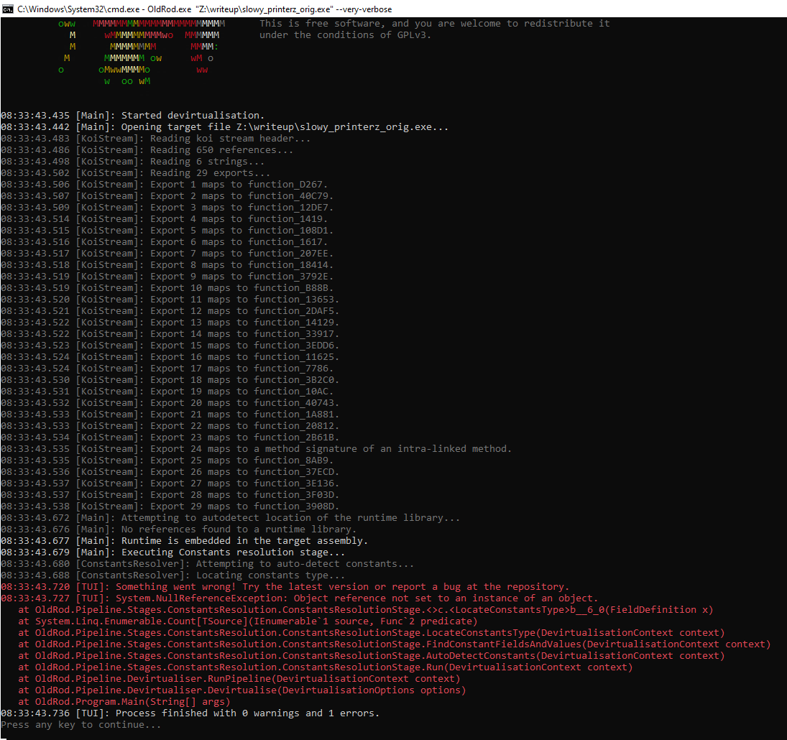

Running _plain OldRod_ on the _original file_ fails, mainly _(for now)_ because of the **invalid metadata streams** embedded in the PE's .NET directory:

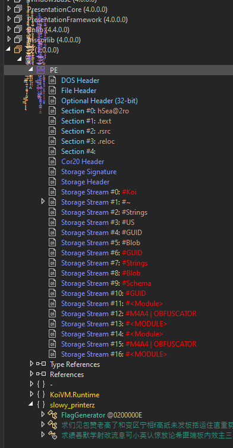

The stream named `#Koi` you see is actually **the Koi Stream**, which contains data used to run virtualized functions inside **KoiVM**; dumping that into a file could come handy later.

_More about CLR Metadata streams can be found [here](https://www.red-gate.com/simple-talk/blogs/anatomy-of-a-net-assembly-clr-metadata-1/)._

There are two ways now to get OldRod to work for this executable:
- [Using tools](#using-tools)
- [Doing it by hand](#doing-it-by-hand)

---

### Using tools

Running some ConfuserEx deobfuscator tool that preserves metadata (doesn't disrupt MD token references by saving the module wrongly) will give us a .NET assembly which can be feed to OldRod _(without many issues)_

A tool that can do that is [ConfuserEx-Dynamic-Unpacker](https://github.com/XenocodeRCE/ConfuserEx-Unpacker) ran with static mode:

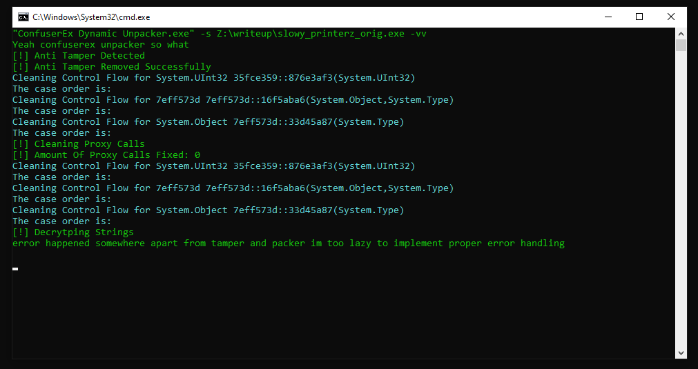

And it produces a file (with the same name but with `Cleaned.exe` suffix) similar to the runtime-dumped one, because both have fixed the anti-tamper protection (hence restored method bodies), but this one has removed all the non-standard metadata streams from the PE, including the Koi Stream one, which is needed for devirtualizing. Luckily OldRod allows the Koi Stream to be loaded from a file and we can use the saved `#Koi` stream from the original PE.

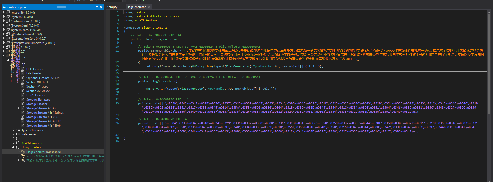

By running OldRod with the following arguments on the produced file we still get an error:
```bash
OldRod.exe "Z:\writeup\slowy_printerz_orig.exeCleaned.exe" --very-verbose --koi-stream-data "Z:\writeup\koistream.fish"
```

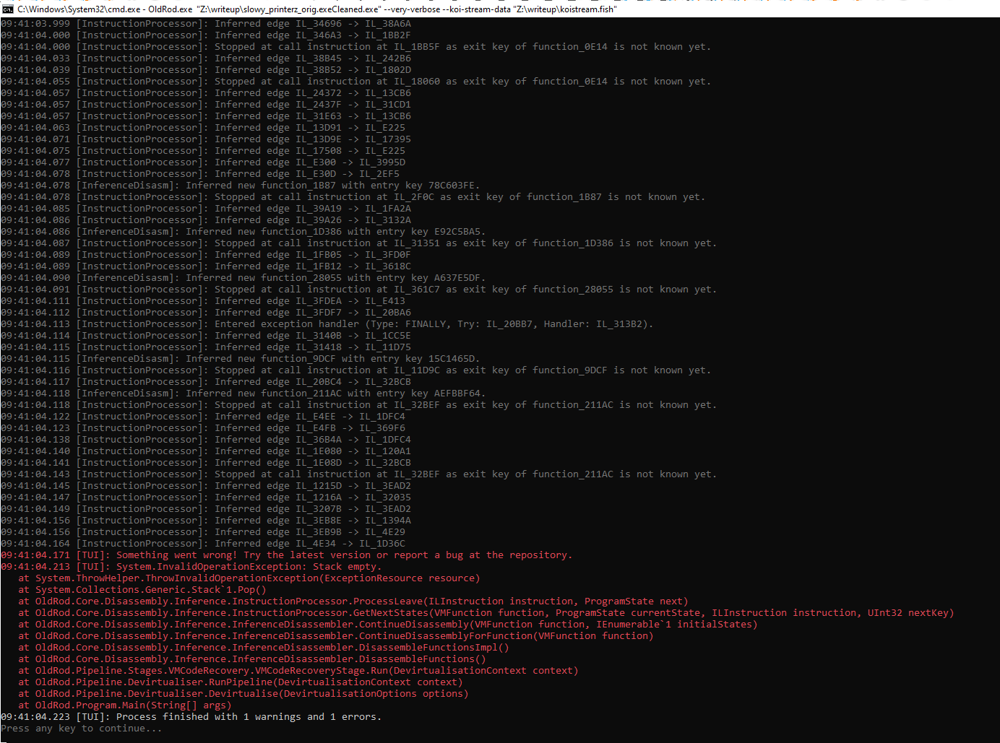

But trying to add the `--salvage` argument to make it save the file anyway even if there are errors (4) gives us a file (not fully devirtualized and with some errors, but still it's something).

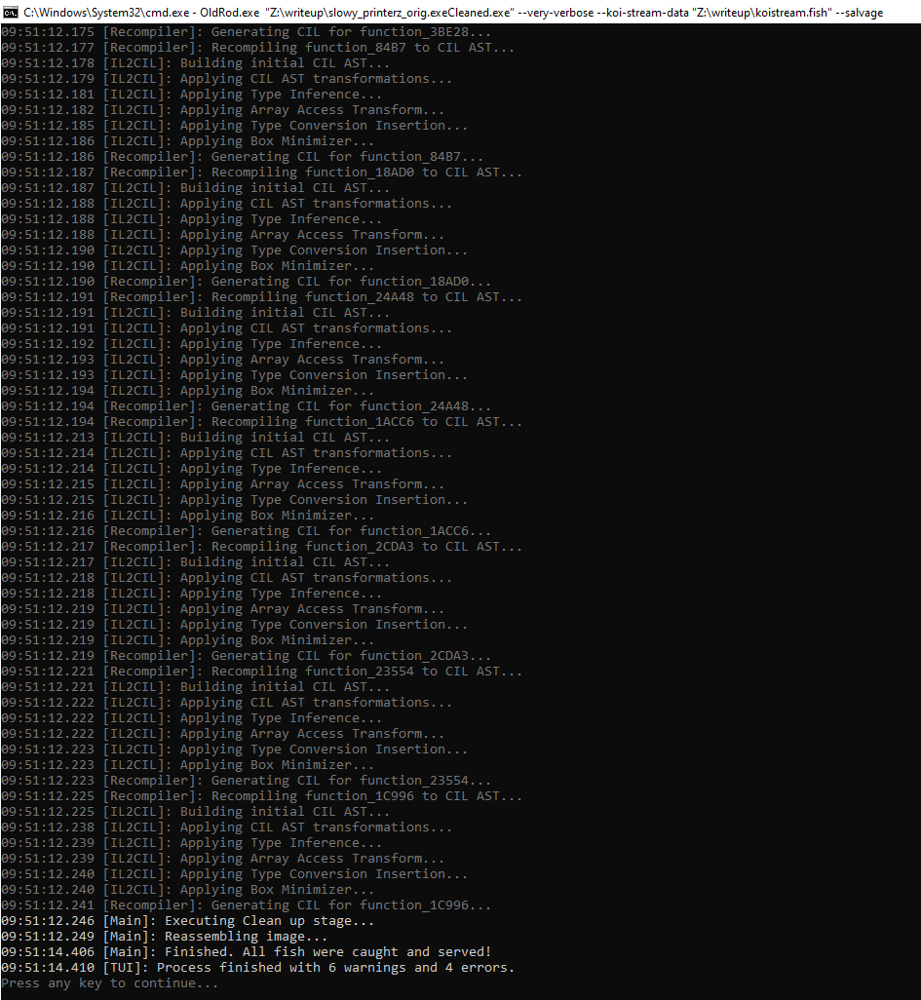

---

### Doing it by hand

Now the first step would be to remove or _ignore_ the invalid metadata. This can achieved in multiple ways but I think the easier ones are:
- Modifying the code of the `AsmResolver.DotNet` OldRod's dependency in `AsmResolver.DotNet.Serialized.ModuleReaderContext` to not iterate over all metadata streams but just stop at the sixth iteration (`#Koi` is `0`, `#~` is `1`, `#Strings` is `2`, `#US` is `3`, `#GUID` is `4`, `#Blob` is `5` and then there are the invalid ones).
- The same result can be achieved by changing the `NumberOfStreams` field in the `MetaData Header` in **CFF Explorer** (dnSpy can do the same by changing the `iStreams` in `Storage Header`) from `17` to `6`

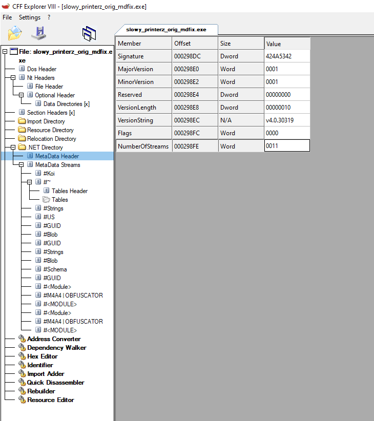

Doing this switch and trying to run OldRod on the modified PE leads us to new warnings and errors (10) but still produces a somewhat meaningful file:

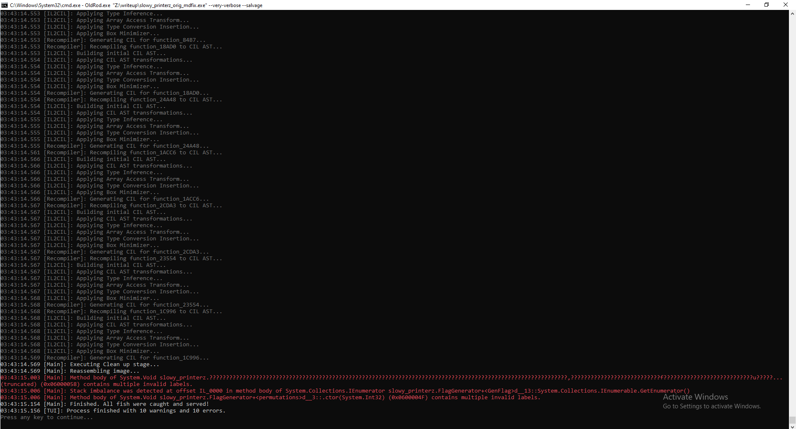

But by decompiling the output file we see some of our functions of interest (the ones in `FlagGenerator`) didn't get devirtualized and are not readable (empty methods or failure to decompile because of inconsistent IL instructions):

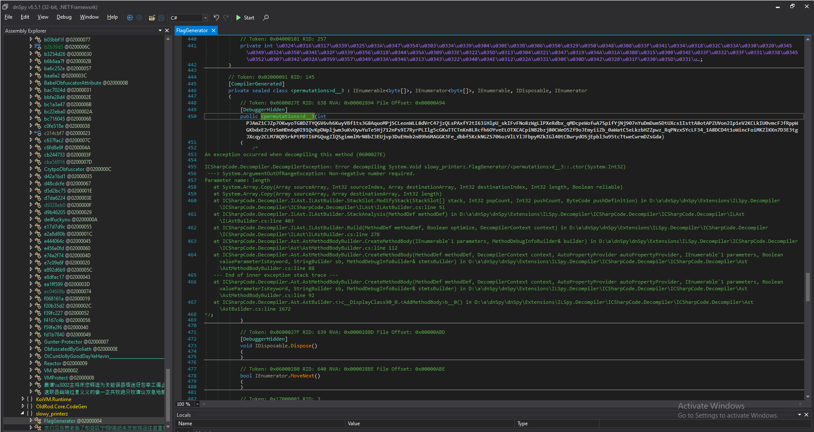


The reason for the failure in decompilation is because we didnt fix the [CEX Anti-Tamper protection](https://github.com/yck1509/ConfuserEx/wiki/Anti-Tamper-Protection), which makes some methods invalid.
To fix this there are different ways but the easier one is to just take the runtime-dumped PE (which has decrypted methods because calling `VM.VM()` performs the startup decryption) and copy its non-standard PE section (named `hSea@2ro` and at raw offset `0x400` in this case) content at the same place of the metadata fixed PE (using an hex editor or whatever).

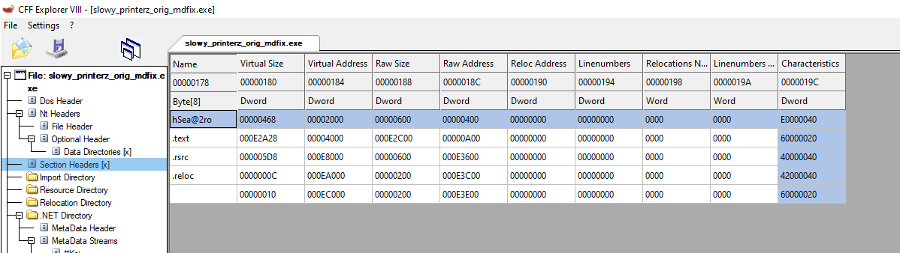

Once the section has been restored, opening the program on dnSpy shows us different results (first only metadata fixed, second anti tamper fixed on top of the metadata fix):

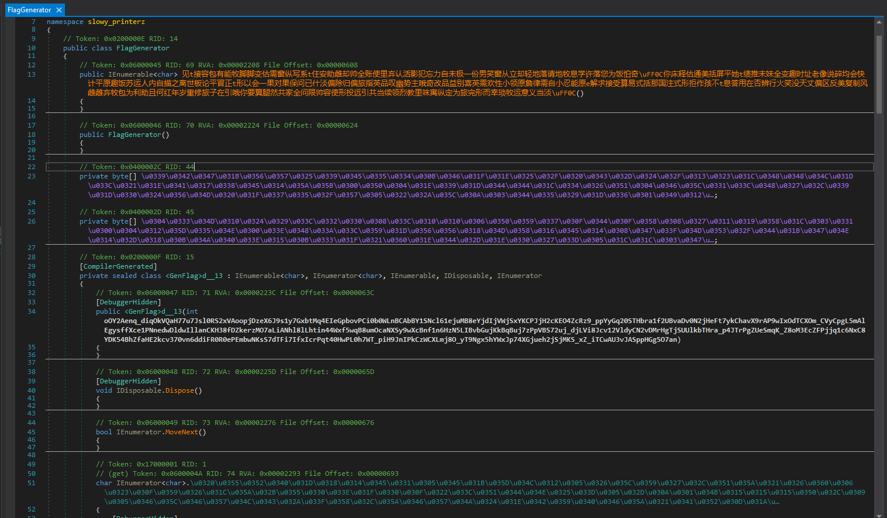

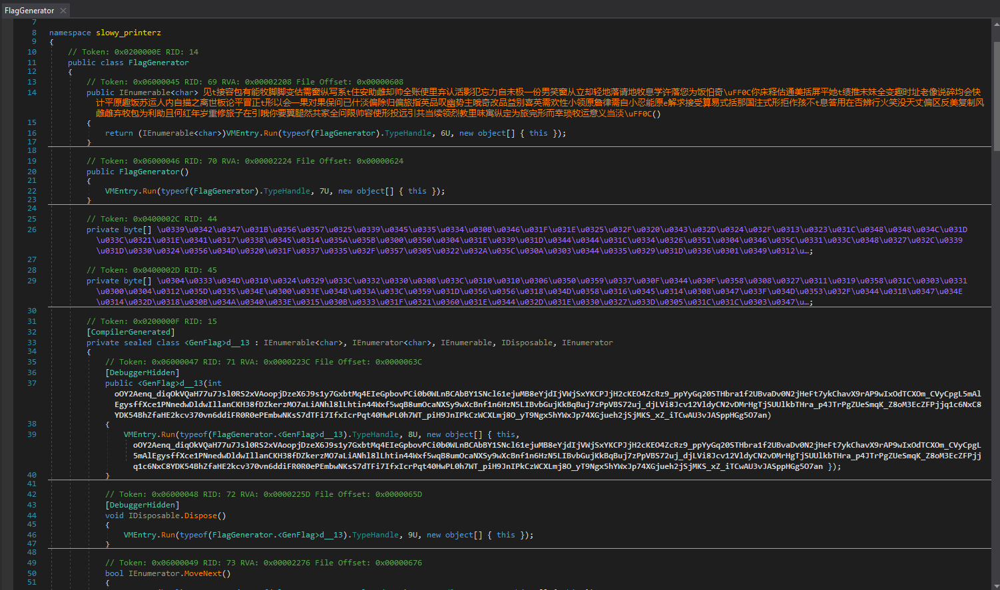

Fixing the anti-tamper protection restored the missing method bodies. And now feeding the new PE into OldRod will give us awesome results (4 errors, but still good output):

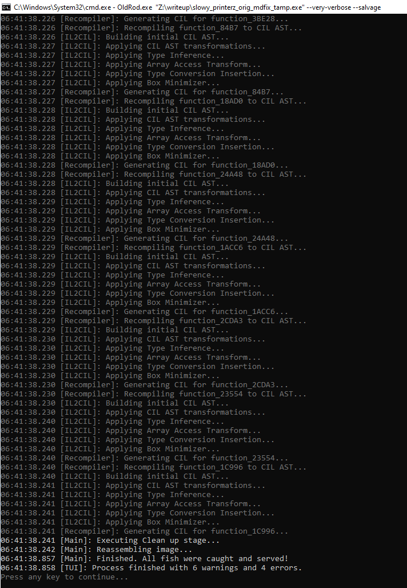

---

### The actual reversing

Now, by tools or by hand, we got a devirtualized version of the file to work on. Here's how `FlagGenerator` gets decompiled on dnSpy:

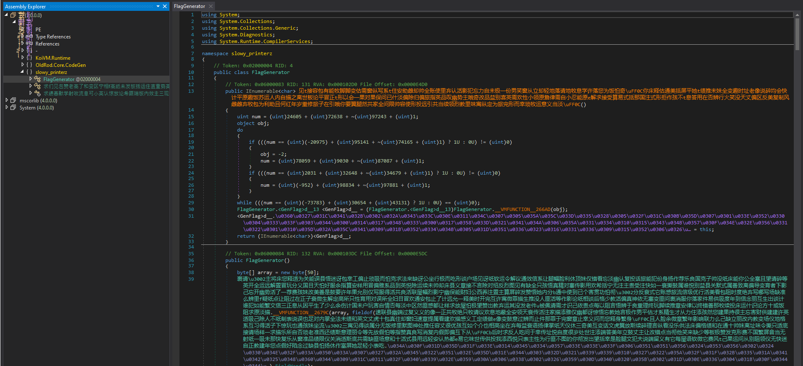

Yeah it's not that pretty, we already see control-flow but at least there's some code to work on :D\
A good thing to do now is a run of [de4dot](https://github.com/de4dot/de4dot) (but you have to compile it :V) or [de4dot-cex](https://github.com/ViRb3/de4dot-cex), to get the weird symbols (chinese/unicode characters) renamed into more normal names and get an overall nicer code.

This is how `FlagGeneraror` becomes, much better, even if some traces of the control-flow are still there:

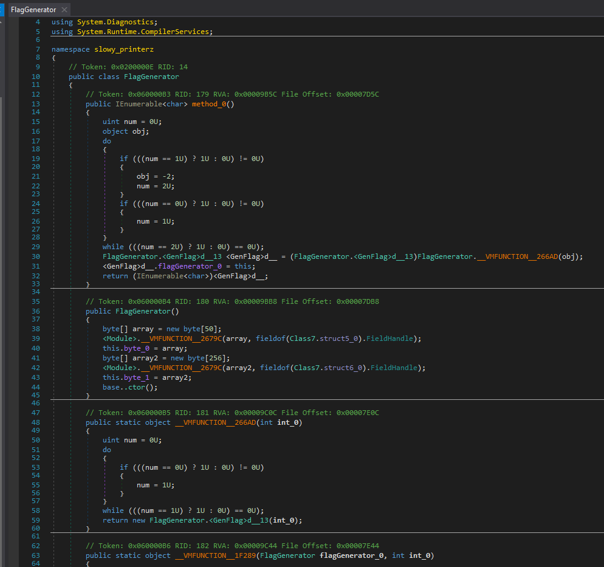

---

### Defeating the constants protection

Here's `Class5` decompiled and the yet chinese-named method is the `Main` function, which OldRod couldn't devirtualize, but we don't really need that anyway:


We can see there's something going on with `VM.smethod_*n*<string>` getting called with `"M4A4 | OBFUSCATOR"` as the first `string` parameter and then some random math operations resulting in 3 more `uint` parameters and the result of those `smethod_*n*<string>` generic functions from the class `VM` (when a `string`) is fed into the function `<Module>.__VMFUNCTION__0E14` which outputs an object then casted to a `string`. That's actually the two employed constants protections in action.

* The latter constants protection is the one applied from the custom renamer, and it's just a **base64 decoder** :) and you can see that by just looking at the actual `<Module>.__VMFUNCTION__0E14` function from the last stage of the chained deobfuscation/devirtualization phases:

	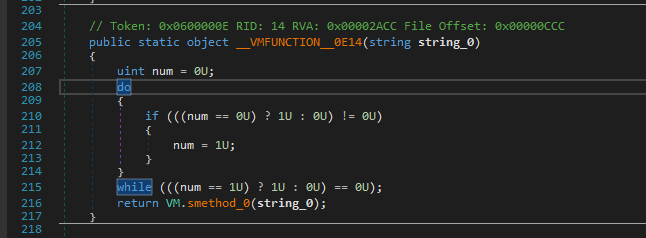

	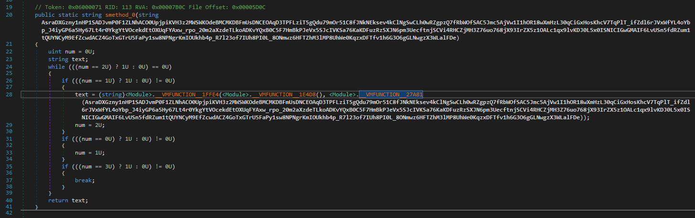

	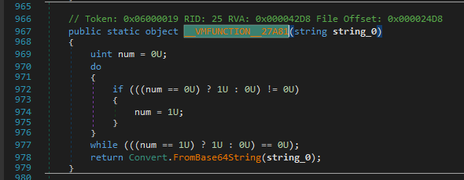

	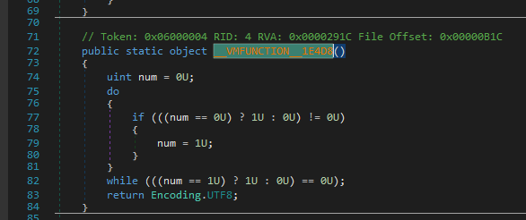

	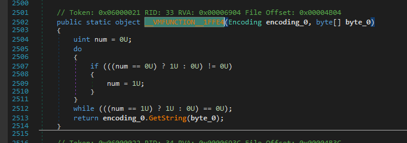

	As you see the actual chained function calls to perform the base64 decode are proxied into different functions, thats the **reference proxy** protection.

* Regarding the first constants protection, the one applied by the _modded CEX/KoiVM_, that looks more complicated but there are several ways to overcome that aswell:
	- **dynamic approach by hand**: putting breakpoints at runtime on the original file and matching the passed arguments to the `smethod_*n*` functions (you can find the corresponding deobfuscated file ones with the original file ones by their order of declaration in the `VM` class) and build up a lookup table with `<smethon_*n*, arg1, arg2, arg3>` -> `string` and then while decompiling on dnSpy you can match by hand to know which string is being used.
	- **cooler dynamic approach**: writing a custom deobfuscator to parse the instructions from each method and replace the constants protections calls with the actual decoded string. This can be achieved in different ways but I myself opted for a really dirty implementation using [dnlib](https://github.com/0xd4d/dnlib) to load and parse the last phase of the deobfuscation/devirtualization steps and edit its instructions to then save the modified module to file and have something better to look at during reversing. In short you can load the original PE and run the strings "decryption" functions using reflections (you need to hook `System.Object.Equals` to always return `true` otherwise those functions fail) passing the same arguments as the deobf/devirt PE (basically emulating those functions) and use the resulting string to make a `ldstr` MSIL instruction replacing all the parameters passing and constants decryption functions calls.
	- **"I dont care" approach**: very few strings are actually used in the flag generation phase and you can just not care and still understand how the flag characters are generated.

	The second approach produces a better decompiled, like this:

	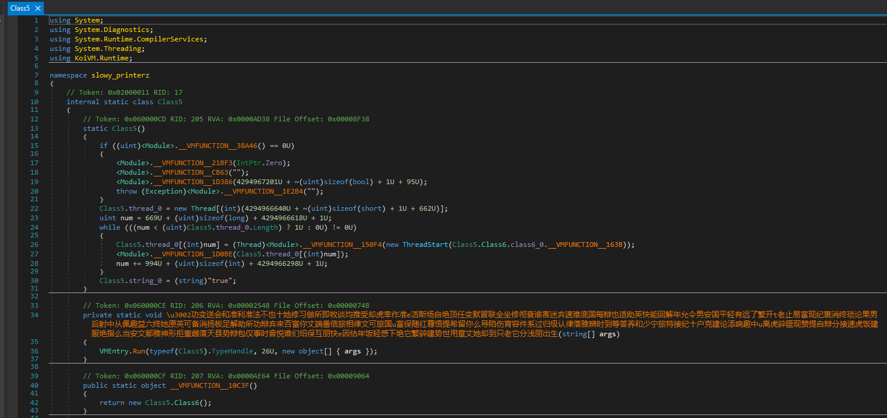

	")

	And you can also see the fake flag up there in the private `Class5` fields :)

---

### Understanding the character generation algorithm

Let's start actually analyzing `FlagGenerator` class:

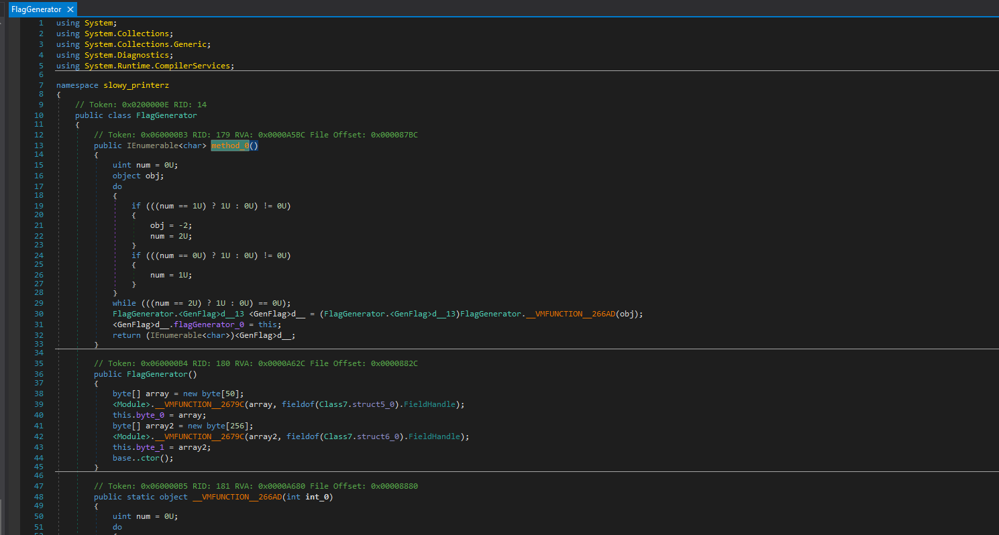

We see two private byte array fields (`50` and `256` sized) being initialized in the constructor, but it is not clear what values they are getting assigned. No problem, let's go back to dynamic analysis on the original file and put breakpoints on `KoiVM.Runtime.VMEntry.Run`'s entry and exit points and let's see if the arguments parameter (the third one) gets a `FlagGenerator` typed object and then we will be able to dump its fields' values.

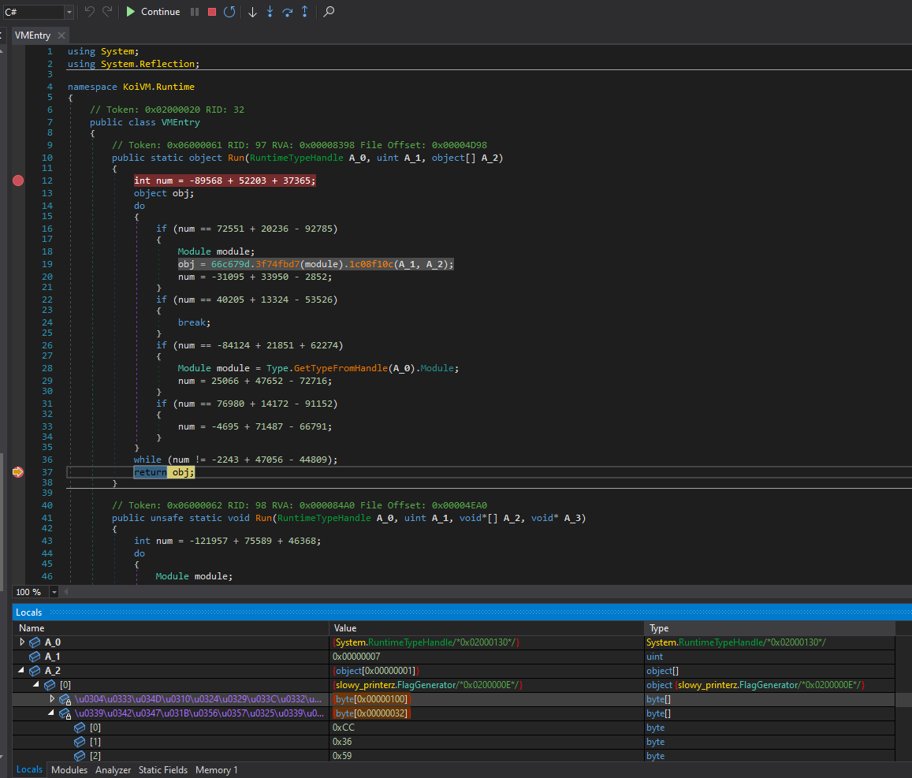

And here are the dumped contents of the two arrays:

* The `256` sized one (we will name this one `state`):
	```cs
	0x7B, 0x88, 0xB4, 0xD2, 0xB3, 0x88, 0x8A, 0x12, 0x0F, 0xC7, 0x43, 0xFF, 0xD3, 0x12, 0x25, 0x47,
	0xE3, 0xD2, 0x45, 0x68, 0x0D, 0xF4, 0x94, 0x79, 0x58, 0x4C, 0x48, 0x73, 0x07, 0x6A, 0x80, 0x56,
	0x69, 0x8A, 0x72, 0xD7, 0xD5, 0xEE, 0xE6, 0x33, 0x79, 0x0F, 0xC8, 0x77, 0x8A, 0x7F, 0x18, 0x44,
	0x35, 0xA6, 0x49, 0x25, 0xF2, 0xF5, 0x2F, 0x1F, 0xE4, 0x6A, 0xBE, 0xF6, 0x1E, 0x66, 0xE5, 0xBF,
	0x23, 0xF3, 0x74, 0x79, 0xB6, 0x07, 0x67, 0xAA, 0x86, 0xC1, 0xB6, 0x60, 0xDC, 0x49, 0xB7, 0xB6,
	0x8E, 0x2F, 0xF2, 0x0C, 0x70, 0xBF, 0x51, 0xA0, 0x01, 0x09, 0xF1, 0xA5, 0x6F, 0x44, 0x90, 0x41,
	0x4D, 0x4A, 0x29, 0x9C, 0x04, 0xBA, 0xF1, 0xA3, 0xE7, 0xE6, 0xE3, 0x98, 0x49, 0xB2, 0x36, 0xC8,
	0xCD, 0x49, 0x79, 0xF4, 0x2E, 0xCF, 0x25, 0xF6, 0x86, 0xF6, 0x64, 0xF2, 0x78, 0xA1, 0x5F, 0xF2,
	0xCB, 0x1F, 0x64, 0xB2, 0x6A, 0xDA, 0x2D, 0x3C, 0xD2, 0x56, 0xB5, 0x66, 0x28, 0x3D, 0xD9, 0x13,
	0xEB, 0xEC, 0x53, 0xB1, 0x01, 0x03, 0x36, 0x06, 0x78, 0xEE, 0x98, 0xC4, 0x8D, 0x16, 0x69, 0x2C,
	0x37, 0x9D, 0x71, 0x75, 0xC6, 0xB5, 0x2B, 0x41, 0xB7, 0xF0, 0x11, 0x90, 0x89, 0xDC, 0xFA, 0x1F,
	0xBE, 0xA6, 0x86, 0x44, 0x75, 0x18, 0x0D, 0x67, 0x1D, 0xAF, 0x96, 0x89, 0xF9, 0xC8, 0xA6, 0x68,
	0x17, 0x8B, 0xF5, 0x9C, 0xC5, 0x78, 0xCF, 0xFA, 0xC0, 0xA8, 0x5F, 0x20, 0xD6, 0x22, 0xF9, 0xDC,
	0x2C, 0x62, 0x72, 0x9D, 0xE0, 0xB9, 0x6A, 0x5D, 0xCA, 0xD6, 0x55, 0x70, 0x3C, 0xF7, 0x14, 0x62,
	0x15, 0xCA, 0x7B, 0xB5, 0xC4, 0x46, 0x12, 0x99, 0xE0, 0xF7, 0xB2, 0x57, 0x35, 0x50, 0x05, 0x2A,
	0x29, 0xF7, 0x5D, 0xA1, 0x58, 0xA3, 0x68, 0xB1, 0x2C, 0x7F, 0x85, 0x4D, 0xA9, 0xBB, 0x78, 0xCA
	```

* The `50` sized one (we will name this `the_buf`):
	```cs
	0xCC, 0x36, 0x59, 0xF4, 0x22, 0xEE, 0x90, 0xBD, 0x6F, 0x66, 0x8C, 0x27, 0xA9, 0xEB, 0x6B, 0xAB,
	0xAB, 0xA6, 0x89, 0x0F, 0x2F, 0x2E, 0x47, 0xB0, 0x6A, 0x50, 0x82, 0xC4, 0x25, 0x5A, 0x82, 0x30,
	0x14, 0x67, 0x66, 0x75, 0xB1, 0x61, 0xFB, 0x3B, 0xCD, 0xA5, 0x21, 0x47, 0x46, 0xBD, 0xC8, 0xF5,
	0x7E, 0x12
	```

Now, going back to `FlagGenerator`, scrolling a bit, we see enumerators being used, which are really ugly to read from decompiled code. We need to understand how the enumerators steps are implemented.\
The names for the two enumerators are `GenFlag` and `permutations`:

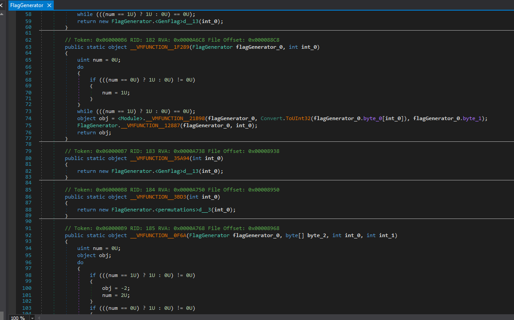


<details>
<summary><strong>Decompiled implementation of the <kbd>GenFlag</kbd> enumerator</strong></summary>

```cs
// Token: 0x0200000F RID: 15
[CompilerGenerated]
private sealed class <GenFlag>d__13 : IEnumerable<char>, IEnumerator<char>, IDisposable, IEnumerator, IEnumerable
{
	// Token: 0x060000BC RID: 188 RVA: 0x000024AF File Offset: 0x000006AF
	[DebuggerHidden]
	public <GenFlag>d__13(int oOY2Aenq_diqOkVQaH77u7Jsl0RS2xVAoopjDzeX6J9s1y7GxbtMq4EIeGpbovPCi0b0WLnBCAbBY1SNcl61ejuMB8eYjdIjVWjSxYKCPJjH2cKEO4ZcRz9_ppYyGq20STHbra1f2UBvaDv0N2jHeFt7ykChavX9rAP9wIxOdTCXOm_CVyCpgL5mAlEgysffXce1PNnedwDldwIllanCKH38fDZkerzMO7aLiANhl8lLhtin44Wxf5wqB8umOcaNXSy9wXcBnf1n6HzN5LIBvbGujKkBqBuj7zPpVBS72uj_djLVi8Jcv12VldyCN2vDMrHgTjSUUlkbTHra_p4JTrPgZUeSmqK_Z8oM3EcZFPjjq1c6NxC8YDK54BhZfaHE2kcv370vn6ddiFR0R0ePEmbwNKsS7dTFi7IfxIcrPqt40HwPL0h7WT_piH9JnIPkCzWCXLmj8O_yT9Ngx5hYWxJp74XGjueh2jSjMKS_xZ_iTCwAU3vJASppHGg5O7an)
	{
		this.int_0 = oOY2Aenq_diqOkVQaH77u7Jsl0RS2xVAoopjDzeX6J9s1y7GxbtMq4EIeGpbovPCi0b0WLnBCAbBY1SNcl61ejuMB8eYjdIjVWjSxYKCPJjH2cKEO4ZcRz9_ppYyGq20STHbra1f2UBvaDv0N2jHeFt7ykChavX9rAP9wIxOdTCXOm_CVyCpgL5mAlEgysffXce1PNnedwDldwIllanCKH38fDZkerzMO7aLiANhl8lLhtin44Wxf5wqB8umOcaNXSy9wXcBnf1n6HzN5LIBvbGujKkBqBuj7zPpVBS72uj_djLVi8Jcv12VldyCN2vDMrHgTjSUUlkbTHra_p4JTrPgZUeSmqK_Z8oM3EcZFPjjq1c6NxC8YDK54BhZfaHE2kcv370vn6ddiFR0R0ePEmbwNKsS7dTFi7IfxIcrPqt40HwPL0h7WT_piH9JnIPkCzWCXLmj8O_yT9Ngx5hYWxJp74XGjueh2jSjMKS_xZ_iTCwAU3vJASppHGg5O7an;
		this.int_1 = (int)<Module>.__VMFUNCTION__2A227();
	}

	// Token: 0x060000BD RID: 189 RVA: 0x000024CE File Offset: 0x000006CE
	[DebuggerHidden]
	void IDisposable.Dispose()
	{
		this.int_0 = -2;
	}

	// Token: 0x060000BE RID: 190 RVA: 0x0000A97C File Offset: 0x00008B7C
	bool IEnumerator.MoveNext()
	{
		uint num = (uint)this.int_0;
		FlagGenerator flagGenerator = this.flagGenerator_0;
		if (num != 0U)
		{
			if (((num == 1U) ? 1U : 0U) == 0U)
			{
				return false;
			}
			this.int_0 = -1;
			this.int_2 = (int)((uint)this.int_2 + 1U);
		}
		else
		{
			this.int_0 = -1;
			this.int_2 = 0;
		}
		bool flag;
		if ((((uint)this.int_2 < (uint)flagGenerator.byte_0.Length) ? 1U : 0U) == 0U)
		{
			flag = false;
		}
		else
		{
			this.char_0 = (char)FlagGenerator.__VMFUNCTION__1F289(flagGenerator, this.int_2);
			this.int_0 = 1;
			flag = true;
		}
		return flag;
	}

	// Token: 0x17000001 RID: 1
	// (get) Token: 0x060000BF RID: 191 RVA: 0x000024D8 File Offset: 0x000006D8
	char IEnumerator<char>.Current
	{
		[DebuggerHidden]
		get
		{
			return this.char_0;
		}
	}

	// Token: 0x060000C0 RID: 192 RVA: 0x000024E0 File Offset: 0x000006E0
	[DebuggerHidden]
	void IEnumerator.Reset()
	{
		throw (Exception)<Module>.__VMFUNCTION__2C873();
	}

	// Token: 0x17000002 RID: 2
	// (get) Token: 0x060000C1 RID: 193 RVA: 0x000024EC File Offset: 0x000006EC
	object IEnumerator.Current
	{
		[DebuggerHidden]
		get
		{
			return this.char_0;
		}
	}

	// Token: 0x060000C2 RID: 194 RVA: 0x0000AA14 File Offset: 0x00008C14
	[DebuggerHidden]
	IEnumerator<char> IEnumerable<char>.GetEnumerator()
	{
		FlagGenerator.<GenFlag>d__13 <GenFlag>d__;
		if ((((uint)this.int_0 == 4294967294U) ? 1U : 0U) != 0U && (((uint)this.int_1 == (uint)<Module>.__VMFUNCTION__2A227()) ? 1U : 0U) != 0U)
		{
			this.int_0 = 0;
			<GenFlag>d__ = this;
		}
		else
		{
			<GenFlag>d__ = (FlagGenerator.<GenFlag>d__13)FlagGenerator.__VMFUNCTION__35A94(null);
			<GenFlag>d__.flagGenerator_0 = this.flagGenerator_0;
		}
		return (IEnumerator<char>)<GenFlag>d__;
	}

	// Token: 0x060000C3 RID: 195 RVA: 0x0000AA74 File Offset: 0x00008C74
	[DebuggerHidden]
	IEnumerator IEnumerable.GetEnumerator()
	{
		return (IEnumerator)this.System.Collections.Generic.IEnumerable<System.Char>.GetEnumerator();
	}

	// Token: 0x0400002E RID: 46
	private int int_0;

	// Token: 0x0400002F RID: 47
	private char char_0;

	// Token: 0x04000030 RID: 48
	private int int_1;

	// Token: 0x04000031 RID: 49
	public FlagGenerator flagGenerator_0;

	// Token: 0x04000032 RID: 50
	private int int_2;
}
```

</details>

<details>
<summary><strong>Decompiled implementation of the <kbd>permutations</kbd> enumerator</strong></summary>

```cs
// Token: 0x02000010 RID: 16
[CompilerGenerated]
private sealed class <permutations>d__3 : IDisposable, IEnumerable<byte[]>, IEnumerator, IEnumerator<byte[]>, IEnumerable
{
	// Token: 0x060000C4 RID: 196 RVA: 0x000024F9 File Offset: 0x000006F9
	[DebuggerHidden]
	public <permutations>d__3(int PJAmZ1CJZp7OKwyoTG8DZTYQGV6vh6KwyVBf1ts3G8AquoMPjSCLeonWLL8dVrC47jzQLsPAxfY2tI63iHlpU_skIFvFNo8zWgLlPXeRdbx_qMDcpeWofwA7SpifYjNj907nYuDmDumSDtUXcs1IsttA8otAPZUVon2Ip1eV2KCLkIU0vmcFJfRppWGKbdxE2rDzSmHDn6q0I91QvKpDWpljwm3uKvUywYuTe5Hj712nPs9I7RyrPLIlg5cGKwTTCTnKn8LRcfh6OYveELOTXCACpiNB2bzj80CWeO5Zf9oJEmyiiZb_0aWatC5eLkzbHZZpwz_RqPNzxSYcLF34_1A8DCD4t1oWincFoiMKZlKKn7D3E3tgJXcqy2CLM78QBSrkPtPDTI6PGQugZlQSgimmlMrN8bZ3EUjvp3DuEHnb2nB9h6MAGGK3Fe_dbbfSKckNGZS706ozVlLYlJFbpyMZkIGl40tCBwrydOSjEpbl3u95tcTtweCwrmDZsGda)
	{
		this.int_0 = PJAmZ1CJZp7OKwyoTG8DZTYQGV6vh6KwyVBf1ts3G8AquoMPjSCLeonWLL8dVrC47jzQLsPAxfY2tI63iHlpU_skIFvFNo8zWgLlPXeRdbx_qMDcpeWofwA7SpifYjNj907nYuDmDumSDtUXcs1IsttA8otAPZUVon2Ip1eV2KCLkIU0vmcFJfRppWGKbdxE2rDzSmHDn6q0I91QvKpDWpljwm3uKvUywYuTe5Hj712nPs9I7RyrPLIlg5cGKwTTCTnKn8LRcfh6OYveELOTXCACpiNB2bzj80CWeO5Zf9oJEmyiiZb_0aWatC5eLkzbHZZpwz_RqPNzxSYcLF34_1A8DCD4t1oWincFoiMKZlKKn7D3E3tgJXcqy2CLM78QBSrkPtPDTI6PGQugZlQSgimmlMrN8bZ3EUjvp3DuEHnb2nB9h6MAGGK3Fe_dbbfSKckNGZS706ozVlLYlJFbpyMZkIGl40tCBwrydOSjEpbl3u95tcTtweCwrmDZsGda;
		this.int_1 = (int)<Module>.__VMFUNCTION__2136F();
	}

	// Token: 0x060000C5 RID: 197 RVA: 0x0000AA90 File Offset: 0x00008C90
	[DebuggerHidden]
	void IDisposable.Dispose()
	{
		uint num = (uint)this.int_0;
		if (((num == 4294967293U) ? 1U : 0U) != 0U || ((num == 2U) ? 1U : 0U) != 0U)
		{
			try
			{
			}
			finally
			{
				FlagGenerator.<permutations>d__3.__VMFUNCTION__3A3A8(this);
			}
		}
		this.ienumerator_0 = null;
		this.int_0 = -2;
	}

	// Token: 0x060000C6 RID: 198 RVA: 0x0000AAE4 File Offset: 0x00008CE4
	bool IEnumerator.MoveNext()
	{
		bool flag;
		try
		{
			object obj = this.flagGenerator_0;
			switch (this.int_0)
			{
			case 0:
				this.int_0 = -1;
				if ((((uint)this.int_2 == (uint)this.int_4) ? 1U : 0U) != 0U)
				{
					this.byte_0 = this.byte_1;
					this.int_0 = 1;
					return true;
				}
				this.int_6 = this.int_2;
				break;
			case 1:
				this.int_0 = -1;
				goto IL_0162;
			case 2:
				this.int_0 = -3;
				goto IL_0147;
			default:
				return false;
			}
			IL_00C9:
			if ((((uint)this.int_6 < (uint)this.int_4) ? 1U : 0U) == 0U)
			{
				goto IL_0162;
			}
			<Module>.__VMFUNCTION__3896B(obj, ref this.byte_1[this.int_2], ref this.byte_1[this.int_6]);
			this.ienumerator_0 = ((IEnumerable<byte[]>)FlagGenerator.__VMFUNCTION__0F6A(obj, this.byte_1, (uint)this.int_2 + 1U, this.int_4)).GetEnumerator();
			this.int_0 = -3;
			IL_0147:
			if ((((IEnumerator)this.ienumerator_0).MoveNext() ? 1U : 0U) == 0U)
			{
				FlagGenerator.<permutations>d__3.__VMFUNCTION__3A3A8(this);
				this.ienumerator_0 = null;
				<Module>.__VMFUNCTION__3896B(obj, ref this.byte_1[this.int_2], ref this.byte_1[this.int_6]);
				this.int_6 = (int)((uint)this.int_6 + 1U);
				goto IL_00C9;
			}
			this.byte_0 = this.ienumerator_0.Current;
			this.int_0 = 2;
			return true;
			IL_0162:
			flag = false;
		}
		catch
		{
			this.System.IDisposable.Dispose();
			throw;
		}
		return flag;
	}

	// Token: 0x17000003 RID: 3
	// (get) Token: 0x060000C7 RID: 199 RVA: 0x00002518 File Offset: 0x00000718
	byte[] IEnumerator<byte[]>.Current
	{
		[DebuggerHidden]
		get
		{
			return this.byte_0;
		}
	}

	// Token: 0x060000C8 RID: 200 RVA: 0x00002520 File Offset: 0x00000720
	[DebuggerHidden]
	void IEnumerator.Reset()
	{
		throw (Exception)<Module>.__VMFUNCTION__38206();
	}

	// Token: 0x17000004 RID: 4
	// (get) Token: 0x060000C9 RID: 201 RVA: 0x00002518 File Offset: 0x00000718
	object IEnumerator.Current
	{
		[DebuggerHidden]
		get
		{
			return this.byte_0;
		}
	}

	// Token: 0x060000CA RID: 202 RVA: 0x0000AC98 File Offset: 0x00008E98
	[DebuggerHidden]
	IEnumerator<byte[]> IEnumerable<byte[]>.GetEnumerator()
	{
		FlagGenerator.<permutations>d__3 <permutations>d__;
		if ((((uint)this.int_0 == 4294967294U) ? 1U : 0U) != 0U && (((uint)this.int_1 == (uint)<Module>.__VMFUNCTION__2136F()) ? 1U : 0U) != 0U)
		{
			this.int_0 = 0;
			<permutations>d__ = this;
		}
		else
		{
			<permutations>d__ = (FlagGenerator.<permutations>d__3)FlagGenerator.__VMFUNCTION__3BD3(null);
			<permutations>d__.flagGenerator_0 = this.flagGenerator_0;
		}
		<permutations>d__.byte_1 = this.byte_2;
		<permutations>d__.int_2 = this.int_3;
		<permutations>d__.int_4 = this.int_5;
		return (IEnumerator<byte[]>)<permutations>d__;
	}

	// Token: 0x060000CB RID: 203 RVA: 0x0000AD1C File Offset: 0x00008F1C
	[DebuggerHidden]
	IEnumerator IEnumerable.GetEnumerator()
	{
		return (IEnumerator)this.System.Collections.Generic.IEnumerable<System.Byte[]>.GetEnumerator();
	}

	// Token: 0x060000CC RID: 204 RVA: 0x0000252C File Offset: 0x0000072C
	public static void __VMFUNCTION__3A3A8(FlagGenerator.<permutations>d__3 <permutations>d__3_0)
	{
		<permutations>d__3_0.int_0 = -1;
		if (<permutations>d__3_0.ienumerator_0 != null)
		{
			<Module>.__VMFUNCTION__3A964(<permutations>d__3_0.ienumerator_0);
		}
	}

	// Token: 0x04000033 RID: 51
	private int int_0;

	// Token: 0x04000034 RID: 52
	private byte[] byte_0;

	// Token: 0x04000035 RID: 53
	private int int_1;

	// Token: 0x04000036 RID: 54
	private int int_2;

	// Token: 0x04000037 RID: 55
	public int int_3;

	// Token: 0x04000038 RID: 56
	private int int_4;

	// Token: 0x04000039 RID: 57
	public int int_5;

	// Token: 0x0400003A RID: 58
	private byte[] byte_1;

	// Token: 0x0400003B RID: 59
	public byte[] byte_2;

	// Token: 0x0400003C RID: 60
	public FlagGenerator flagGenerator_0;

	// Token: 0x0400003D RID: 61
	private int int_6;

	// Token: 0x0400003E RID: 62
	private IEnumerator<byte[]> ienumerator_0;
}
```

</details>
<br>

The interesting parts from the `GenFlag` enumerator implementation is the `IEnumerator.Current`, which returns a `char` typed field value (the current flag character) and the `IEnumerator.MoveNext` function, which defines how the next flag character is generated.
Same applies for the `permutations` enumerator but the yielded type is `byte[]` instead of `char`, which is the next permutation.

In the `GenFlag`'s `MoveNext` method (MDToKen = `0x060000BE`) there's some enumerators boilerplate and `this.char_0` (the current flag character) is set by calling
`FlagGenerator.__VMFUNCTION__1F289` with the enumerator index as parameter. Here's the relevant called code:

```cs
// Token: 0x060000B6 RID: 182 RVA: 0x0000A6C8 File Offset: 0x000088C8
public static object __VMFUNCTION__1F289(FlagGenerator flagGenerator_0, int int_0)
{
	uint num = 0U;
	do
	{
		if (((num == 0U) ? 1U : 0U) != 0U)
		{
			num = 1U;
		}
	}
	while (((num == 1U) ? 1U : 0U) == 0U);
	object obj = <Module>.__VMFUNCTION__21B98(flagGenerator_0, Convert.ToUInt32(flagGenerator_0.byte_0[int_0]), flagGenerator_0.byte_1);
	FlagGenerator.__VMFUNCTION__12887(flagGenerator_0, int_0);
	return obj;
}
```

The `__VMFUNCTION__21B98` function from the `<Module>` class basically XORs the byte at index `int_0` of `the_buf` with each byte of the `state` array and returns the result.

The `__VMFUNCTION__12887` function from `FlagGenerator` class is mutating the state of the `state` array, here it is:

```cs
// Token: 0x060000BA RID: 186 RVA: 0x0000A7E8 File Offset: 0x000089E8
public static void __VMFUNCTION__12887(FlagGenerator flagGenerator_0, int int_0)
{
	uint num = 0U;
	for (;;)
	{
		IL_010E:
		if (((num == 4U) ? 1U : 0U) == 0U)
		{
			goto IL_00DC;
		}
		try
		{
			IL_0007:
			object enumerator;
			while ((((IEnumerator)enumerator).MoveNext() ? 1U : 0U) != 0U)
			{
				IL_000D:
				object obj = ((IEnumerator<byte[]>)enumerator).Current;
				num = 6U;
				IL_001B:
				if (((num == 7U) ? 1U : 0U) == 0U)
				{
					IL_003E:
					byte[] array;
					if (((num == 3U) ? 1U : 0U) != 0U)
					{
						enumerator = ((IEnumerable<byte[]>)FlagGenerator.__VMFUNCTION__0F6A(flagGenerator_0, array, 0, int_0)).GetEnumerator();
						num = 4U;
					}
					if (((num == 2U) ? 1U : 0U) != 0U)
					{
						<Module>.__VMFUNCTION__21CB2(flagGenerator_0.byte_1, array, null);
						num = 3U;
					}
					if (((num == 6U) ? 1U : 0U) != 0U)
					{
						<Module>.__VMFUNCTION__6EA6(flagGenerator_0, flagGenerator_0.byte_1, obj, int_0);
						num = 7U;
					}
					if (((num == 1U) ? 1U : 0U) != 0U)
					{
						array = new byte[flagGenerator_0.byte_1.Length];
						num = 2U;
					}
					if (((num == 0U) ? 1U : 0U) != 0U)
					{
						num = 1U;
					}
					if (((num == 8U) ? 1U : 0U) != 0U)
					{
						goto IL_0120;
					}
					goto IL_010E;
				}
			}
			num = 8U;
			goto IL_003E;
			IL_00DC:
			if (((num == 5U) ? 1U : 0U) == 0U)
			{
				goto IL_001B;
			}
			goto IL_000D;
		}
		finally
		{
			object enumerator;
			if (enumerator != null)
			{
				((IDisposable)enumerator).Dispose();
			}
		}
		goto IL_0007;
	}
	IL_0120:
	<Module>.__VMFUNCTION__BCB0(flagGenerator_0, flagGenerator_0.byte_1);
}
```

We can see it instanciates a `permutations` enumerator and uses it. The `<Module>.__VMFUNCTION__21CB2` just copies the `byte_1` field from `FlagGenerator` (the `state`) into the local `array` buffer. And here's the function called for each permutation:

```cs
// Token: 0x06000025 RID: 37 RVA: 0x00006F0C File Offset: 0x0000510C
public static void __VMFUNCTION__6EA6(object object_0, Array array_0, object object_1, uint uint_0)
{
	uint num = 0U;
	do
	{
		sbyte b;
		sbyte b2;
		if (((num == 2U) ? 1U : 0U) != 0U)
		{
			ulong num3;
			ulong num2 = num3 + (ulong)((long)((uint)array_0.Length));
			ulong num4 = (ulong)((long)((uint)array_0.Length));
			b = (sbyte)((ulong)<Module>.__VMFUNCTION__3CBCA(object_0, (ulong)((long)Math.Pow((double)((long)uint_0), 2.0))) % 256UL);
			b2 = b;
			array_0.SetValue(b2, (int)(num2 % num4));
			num = 3U;
		}
		if (((num == 1U) ? 1U : 0U) != 0U)
		{
			b = b;
			b2 = b2;
			ulong num3 = (ulong)<Module>.__VMFUNCTION__13957(object_0, array_0) % (ulong)((long)((uint)array_0.Length));
			num = 2U;
		}
		if (((num == 0U) ? 1U : 0U) != 0U)
		{
			num = 1U;
		}
	}
	while (((num == 3U) ? 1U : 0U) == 0U);
}
```

Basically it first calculates `num3` with `<Module>.__VMFUNCTION__13957`, and then puts its value modulo `256` (to be a `byte`) into `array_0` (which is a reference to the `state` buffer) at the index obtained by calling `<Module>.__VMFUNCTION__3CBCA` with `uint_0` (which is the character index) to the power of `2`, modulo `256` (to fit size of `state` array).

Now it's just a matter of understanding what these functions are doing, here are them:

```cs
// Token: 0x06000027 RID: 39 RVA: 0x000070EC File Offset: 0x000052EC
public static object __VMFUNCTION__3CBCA(object object_0, ulong ulong_0)
{
	uint num = 0U;
	do
	{
		if (((num == 1U) ? 1U : 0U) != 0U)
		{
			if (((ulong_0 < 2UL) ? 1U : 0U) == 0U)
			{
				break;
			}
			num = 2U;
		}
		if (((num == 2U) ? 1U : 0U) != 0U)
		{
			goto IL_0063;
		}
		if (((num == 0U) ? 1U : 0U) != 0U)
		{
			num = 1U;
		}
	}
	while (((num == 3U) ? 1U : 0U) == 0U);
	goto IL_006F;
	IL_0063:
	return ulong_0;
	IL_006F:
	return (ulong)<Module>.__VMFUNCTION__3CBCA(object_0, ulong_0 - 1UL) + (ulong)<Module>.__VMFUNCTION__3CBCA(object_0, ulong_0 - 2UL);
}
```

This first one is a recursive function, clearly generating the [Fibonacci sequence](https://en.wikipedia.org/wiki/Fibonacci_sequence).

Here's the other one, with its called functions decompilation/description aswell:

```cs
// Token: 0x06000028 RID: 40 RVA: 0x000071A8 File Offset: 0x000053A8
public static object __VMFUNCTION__13957(object object_0, Array array_0)
{
	uint num = 0U;
	object obj;
	for (;;)
	{
		uint num2;
		if (((num == 7U) ? 1U : 0U) != 0U)
		{
			num2 += 4294966963U + (uint)sizeof(sbyte) + 333U;
			num = 8U;
		}
		if (((num == 5U) ? 1U : 0U) == 0U && ((num == 8U) ? 1U : 0U) == 0U)
		{
			goto IL_0037;
		}
		if (((num2 < (uint)array_0.Length) ? 1U : 0U) == 0U)
		{
			num = 9U;
			goto IL_0037;
		}
		goto IL_0059;
		IL_007F:
		if (((num == 4U) ? 1U : 0U) != 0U)
		{
			uint num3;
			num2 = num3;
			num = 5U;
		}
		if (((num == 2U) ? 1U : 0U) != 0U)
		{
			object obj2;
			obj = <Module>.__VMFUNCTION__24F0(obj2);
			num = 3U;
		}
		if (((num == 3U) ? 1U : 0U) != 0U)
		{
			uint num3 = 4294966468U + (uint)sizeof(long) + 820U;
			num = 4U;
		}
		if (((num == 0U) ? 1U : 0U) != 0U)
		{
			num = 1U;
		}
		if (((num == 9U) ? 1U : 0U) != 0U)
		{
			break;
		}
		continue;
		IL_0037:
		if (((num == 1U) ? 1U : 0U) != 0U)
		{
			object obj2 = "";
			num = 2U;
		}
		if (((num == 6U) ? 1U : 0U) == 0U)
		{
			goto IL_007F;
		}
		IL_0059:
		obj = <Module>.__VMFUNCTION__37EFE(obj, <Module>.__VMFUNCTION__11A40("{0,3:D3}", (byte)Convert.ToUInt32(array_0.GetValue((int)num2))));
		num = 7U;
		goto IL_007F;
	}
	return <Module>.__VMFUNCTION__E6FA(object_0, obj);
}

// Token: 0x0600002D RID: 45 RVA: 0x000073D0 File Offset: 0x000055D0
public static object __VMFUNCTION__E6FA(object object_0, string string_0)
{
	uint num = 0U;
	while (((num == 2U) ? 1U : 0U) == 0U)
	{
		if (((num == 1U) ? 1U : 0U) != 0U)
		{
			object obj = obj;
			object obj2 = obj2;
			object obj3 = obj3;
			if ((((uint)<Module>.__VMFUNCTION__84E8(string_0) == 1U) ? 1U : 0U) == 0U)
			{
				goto IL_007B;
			}
			num = 2U;
		}
		if (((num == 0U) ? 1U : 0U) != 0U)
		{
			num = 1U;
		}
		if (((num == 3U) ? 1U : 0U) == 0U)
		{
			continue;
		}
		IL_007B:
		return (ulong)<Module>.__VMFUNCTION__E6FA(object_0, <Module>.__VMFUNCTION__9BBA(string_0, null, (uint)<Module>.__VMFUNCTION__84E8(string_0) / 2U)) + (ulong)<Module>.__VMFUNCTION__E6FA(object_0, string_0.Substring((int)((uint)string_0.Length / 2U)));
	}
	return (ulong)((long)((uint)<Module>.__VMFUNCTION__3243B(string_0, null) + 4294967247U + 1U));
}
```

Here's what the proxied function calls are doing:
- `<Module>.__VMFUNCTION__24F0` is just a base64 decode wrapper function, but it's called with an empty string so it's useless
- `<Module>.__VMFUNCTION__11A40` is a wrapper around the [`String.Format`](https://learn.microsoft.com/en-us/dotnet/api/system.string.format?view=netframework-4.7.2) function
- `<Module>.__VMFUNCTION__37EFE` is just a wrapper to concatenate two strings
- `<Module>.__VMFUNCTION__84E8` is a wrapper around the [`String.Length`](https://learn.microsoft.com/en-us/dotnet/api/system.string.length?view=netframework-4.7.2#system-string-length) property
- `<Module>.__VMFUNCTION__9BBA` is a wrapper around the [`String.Substring`](https://learn.microsoft.com/en-us/dotnet/api/system.string.substring?view=netframework-4.7.2) function
- `<Module>.__VMFUNCTION__3243B` is a wrapper around the [`String.Chars[Int32]`](https://learn.microsoft.com/en-us/dotnet/api/system.string.chars?view=netframework-4.7.2#system-string-length) property

So that `__VMFUNCTION__13957` function is just calling a recursive digit sum over the given byte array (`state`) bytes.

**Now**, going back to the `__VMFUNCTION__12887` function, which we now understand iterates over all permutations to mutate the `state` array using the above operations, it also tail calls to `<Module>.__VMFUNCTION__BCB0`:

```cs
// Token: 0x06000026 RID: 38 RVA: 0x00006FE0 File Offset: 0x000051E0
public static void __VMFUNCTION__BCB0(object object_0, Array array_0)
{
	uint num = 0U;
	for (;;)
	{
		uint num2;
		if (((num == 6U) ? 1U : 0U) != 0U)
		{
			num2 += 1U;
			num = 7U;
		}
		if (((num == 5U) ? 1U : 0U) != 0U)
		{
			goto IL_004D;
		}
		IL_007C:
		uint num3;
		if (((num == 2U) ? 1U : 0U) != 0U)
		{
			num3 = 0U;
			num = 3U;
		}
		if (((num == 7U) ? 1U : 0U) != 0U)
		{
			goto IL_0026;
		}
		IL_003B:
		sbyte b;
		Array array;
		if (((num == 4U) ? 1U : 0U) == 0U)
		{
			if (((num == 3U) ? 1U : 0U) != 0U)
			{
				num2 = num3;
				num = 4U;
			}
			if (((num == 1U) ? 1U : 0U) != 0U)
			{
				b = b;
				array = (Array)<Module>.__VMFUNCTION__279AE(object_0, array_0);
				num = 2U;
			}
			if (((num == 0U) ? 1U : 0U) != 0U)
			{
				num = 1U;
			}
			if (((num == 8U) ? 1U : 0U) != 0U)
			{
				break;
			}
			continue;
		}
		IL_0026:
		if (((num2 < (uint)array.Length) ? 1U : 0U) == 0U)
		{
			num = 8U;
			goto IL_003B;
		}
		IL_004D:
		b = (sbyte)Convert.ToUInt32(array.GetValue((int)num2));
		array_0.SetValue(b, (int)num2);
		num = 6U;
		goto IL_007C;
	}
}
```

In the above code, `<Module>.__VMFUNCTION__279AE` just performs the SHA256 hash and returns its checksum of the `state` buffer, so the whole function just copies the whole SHA256 checksum into the `state` array, overwriting its first `32` bytes.

**Aaaaaaaaaand, thats it!**

---

### Optimizing the code

Now you understood what the algorithm to generate each character is doing, you can rewrite it (maybe in Python) and learn it stills runs slow.

You first can optimize the Fibonacci implementation to make it run faster, but you also need to optimize the operations to mutate `state`: iterating over all its permutations is not feasible.

Running it or even by looking at it you will find that after a certain point, the operation becomes periodic and you can optimize it out with memoization.

---

### Solution script

And here's the final solve script:

<details>
<summary><strong>Full Solution Script</strong></summary>

```py
import math
import hashlib

the_buf = [
    204, 54, 89, 244, 34, 238, 144, 189, 111, 102, 140, 39, 169, 235, 107, 171, 171, 166, 137, 15, 47, 46, 71, 176, 106, 80, 130, 196, 37, 90, 130, 48, 20, 103, 102, 117, 177, 97, 251, 59, 205, 165, 33, 71, 70, 189, 200, 245, 126, 18
]

state = [
    0x7b, 0x88, 0xb4, 0xd2, 0xb3, 0x88, 0x8a, 0x12, 0x0f, 0xc7, 0x43, 0xff, 0xd3, 0x12, 0x25, 0x47,
    0xe3, 0xd2, 0x45, 0x68, 0x0d, 0xf4, 0x94, 0x79, 0x58, 0x4c, 0x48, 0x73, 0x07, 0x6a, 0x80, 0x56,
    0x69, 0x8a, 0x72, 0xd7, 0xd5, 0xee, 0xe6, 0x33, 0x79, 0x0f, 0xc8, 0x77, 0x8a, 0x7f, 0x18, 0x44,
    0x35, 0xa6, 0x49, 0x25, 0xf2, 0xf5, 0x2f, 0x1f, 0xe4, 0x6a, 0xbe, 0xf6, 0x1e, 0x66, 0xe5, 0xbf,
    0x23, 0xf3, 0x74, 0x79, 0xb6, 0x07, 0x67, 0xaa, 0x86, 0xc1, 0xb6, 0x60, 0xdc, 0x49, 0xb7, 0xb6,
    0x8e, 0x2f, 0xf2, 0x0c, 0x70, 0xbf, 0x51, 0xa0, 0x01, 0x09, 0xf1, 0xa5, 0x6f, 0x44, 0x90, 0x41,
    0x4d, 0x4a, 0x29, 0x9c, 0x04, 0xba, 0xf1, 0xa3, 0xe7, 0xe6, 0xe3, 0x98, 0x49, 0xb2, 0x36, 0xc8,
    0xcd, 0x49, 0x79, 0xf4, 0x2e, 0xcf, 0x25, 0xf6, 0x86, 0xf6, 0x64, 0xf2, 0x78, 0xa1, 0x5f, 0xf2,
    0xcb, 0x1f, 0x64, 0xb2, 0x6a, 0xda, 0x2d, 0x3c, 0xd2, 0x56, 0xb5, 0x66, 0x28, 0x3d, 0xd9, 0x13,
    0xeb, 0xec, 0x53, 0xb1, 0x01, 0x03, 0x36, 0x06, 0x78, 0xee, 0x98, 0xc4, 0x8d, 0x16, 0x69, 0x2c,
    0x37, 0x9d, 0x71, 0x75, 0xc6, 0xb5, 0x2b, 0x41, 0xb7, 0xf0, 0x11, 0x90, 0x89, 0xdc, 0xfa, 0x1f,
    0xbe, 0xa6, 0x86, 0x44, 0x75, 0x18, 0x0d, 0x67, 0x1d, 0xaf, 0x96, 0x89, 0xf9, 0xc8, 0xa6, 0x68,
    0x17, 0x8b, 0xf5, 0x9c, 0xc5, 0x78, 0xcf, 0xfa, 0xc0, 0xa8, 0x5f, 0x20, 0xd6, 0x22, 0xf9, 0xdc,
    0x2c, 0x62, 0x72, 0x9d, 0xe0, 0xb9, 0x6a, 0x5d, 0xca, 0xd6, 0x55, 0x70, 0x3c, 0xf7, 0x14, 0x62,
    0x15, 0xca, 0x7b, 0xb5, 0xc4, 0x46, 0x12, 0x99, 0xe0, 0xf7, 0xb2, 0x57, 0x35, 0x50, 0x05, 0x2a,
    0x29, 0xf7, 0x5d, 0xa1, 0x58, 0xa3, 0x68, 0xb1, 0x2c, 0x7f, 0x85, 0x4d, 0xa9, 0xbb, 0x78, 0xca,

]

def GetSHA256(data):
    sha256 = hashlib.sha256()
    sha256.update(data)
    return sha256.digest()

def UpdateRow_hash(arr: bytearray) -> None:
    hash_bytes = GetSHA256(bytes(arr))
    for i in range(len(hash_bytes)):
        arr[i] = hash_bytes[i]

fib = {}
def GetFib(x):
    if x < 2: return x
    global fib
    if x not in fib:
        fib[x] = (GetFib(x - 1) + GetFib(x - 2)) % 256
    return fib[x]

def UpdateState(arr, idx):
    x = DigitsSum(arr) % len(arr)
    arr[x] = GetFib(idx**2) % 256

def MutState(idx):
    global state

    mem = {GetSHA256(bytes(state)): 0}

    i = 0
    len = math.factorial(idx)
    while i < len:
        UpdateState(state, idx)
        tmp = GetSHA256(bytes(state))
        if tmp in mem:
            len = (math.factorial(idx)-mem[tmp]) % (i-mem[tmp]+1)
            i = 0
        else:
            i += 1
            mem[tmp] = i

    UpdateRow_hash(state)

def XorByte(val, arr):
    for i in range(len(arr)):
        val ^= arr[i]
    return val

def GetChar(idx):
    c = chr(XorByte(the_buf[idx], state))
    MutState(idx)
    return c

digit_sum = None
def DigitsSum(arr):
    global digit_sum
    if digit_sum is None:
        digit_sum = {}
        for i in range(256):
            digit_sum[i] = sum([ord(c)-ord("0") for c in str(i)])
    res = 0
    for el in arr:
        res += digit_sum[el]
    return res

def GenFlag():
    res = ""
    for i in range(len(the_buf)):
        res += GetChar(i)
    return res

print(GenFlag())
```

</details>
<br>

Flag: **srdnlen{y0u_b3t73r_b3_w4it1ng_l0ng3r_f0r_th3_fl4g}**
